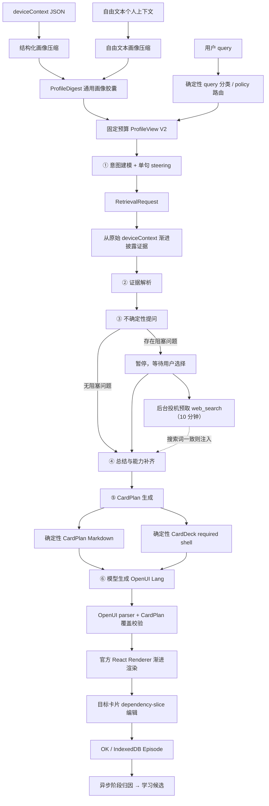

# cot-genui 当前全流程说明

> 实现基线：2026-08-19 `codex/adaptive-learning-card-editing`
> 当前协议：ProfileDigest → ProfileView V2 + CardPlan 单一协议 + OpenUI Lang v0.5
> 主流程：画像预处理 + 6 个可独立执行的推理阶段

本文描述当前代码实际执行的链路。`docs/DESIGN-DOC.md` 记录的是较早的 9 步设计，其中部分步骤、生成模式和文件职责已经发生变化；调试当前页面时应以本文和代码为准。

---

## 1. 系统目标

系统接收三类输入：

1. 用户当前请求 `query`；
2. 结构化设备上下文 `deviceContext`，或者一段自由文本个人上下文；
3. 用户对阻塞性不确定问题的选择题答案。

系统依次完成：

- 建立与 query 无关、可缓存的通用用户画像；
- 根据当前 query 定义任务、交付等级和任务槽位；
- 从原始画像中按需检索证据并解析槽位；
- 在生成前以选择题确认关键不确定项；
- 汇总已确认事实，并在需要时进行一次任务型联网搜索；
- 生成唯一的中间协议 CardPlan；
- 从 CardPlan 确定性派生 CardPlan Markdown，再生成 OpenUI Lang；
- 校验结构、内容覆盖率、动作和外链，必要时降级或修复。
- 在六步外围执行零 LLM query 分类、固定预算 ProfileView V2 和单句 steering；六步顺序、schema、工具和模型选择保持冻结；
- 首次生成后允许对单张卡片做 dependency-slice 编辑；用户点击 OK 后再异步执行阶段归因和受约束策略学习。

---

## 2. 端到端架构



关键设计是：CardPlan 是唯一内部业务 IR；CardPlan Markdown 是它唯一的文本投影。第⑥步模型只接收 Markdown 和 required shell，只负责视觉编排，不能重新决定业务事实、实体或外链。

Adaptive Layer 不构成第七步。query 分类是本地启发式函数，典型耗时低于 2ms、零模型调用；ProfileView V2 是 Step1 的输入投影，字符数不得超过旧 ProfileDigest，默认硬上限 6,000 字符；steering 只是一条额外关注方向，不得改变协议、schema、工具、模型或步骤。Web facts 是可选证据，不得因为存在来源就增加用户无价值的卡片。

卡片编辑和 Reflection 都属于 post-generation：编辑 API 只接收目标卡片闭包并在服务端合并、整体验证成功后替换 UI，不重跑六步；Reflection 只在 OK 且 Episode 已保存后执行，不接触 provider reasoning 或隐藏思维链。它唯一能产生的可变参数是 `profileOverlay` 或现有六步的单句 hint candidate。

---

## 3. 输入和页面状态

### 3.1 输入来源

| 输入 | 页面字段 | 用途 |
|---|---|---|
| 用户请求 | `query` | 决定当前任务目标 |
| 预设/可编辑 JSON | `contextText` | 画像压缩和第二步原始证据检索 |
| 自由文本画像 | `customContextText` | 长度超过 20 字时优先用于生成通用画像摘要 |
| 选择题答案 | `answers[index]` | 第四步前确定性写回相关槽位 |
| 分步模型 | `stepModels[step]` | 每一步均可在六档模型间切换 |

页面由 Zustand store 保存主状态：

- `profileDigest`：query-independent 通用画像；
- `inferenceState`：贯穿前四步的任务推断状态；
- `slots / conflicts / questions / answers`：解释性推理信息；
- `cardPlan`：唯一业务卡片中间协议；
- `cardPlanMarkdown`：从 CardPlan 确定性派生的唯一文本投影；
- `openuiCode / openuiDiagnostics`：OpenUI Lang 流式源码、parser 和覆盖校验结果；
- `steps`：每一步状态、模型、耗时、token、费用和调用日志。
- `queryClassification / stablePolicies`：确定性分类和当前可用策略库；
- `currentEpisode / openuiVersions / cardEditTarget`：当前生成、局部编辑及 Undo/Redo；
- `attributionReport / gradientCandidates`：OK 后异步反思结果，不进入首次生成路径；
- `prefetchedSearch`：暂停期搜索词、provider 原始结果和获取时间；
- 模块级步骤缓存：最多 20 项的前端 LRU，只供“一键全部/继续生成”复用。

### 3.2 修改输入时的失效规则

- 修改 JSON 上下文会清空画像、六步结果、CardPlan Markdown、CardPlan 和 OpenUI；
- 修改 JSON 上下文、切换预设或“重置全部”也会清空步骤 LRU；
- 切换预设会清空旧结果，并异步预热画像；如果仍保留超过 20 字的自由文本，画像入口优先使用自由文本而不是新预设 JSON；
- 修改某一步模型会把该步骤重置为 `pending`，但不会自动重跑后续步骤；
- 点击“重置全部”恢复默认 query、默认预设和默认模型组合；当前实现不会清空 `customContextText`。

---

## 4. 阶段 0：通用画像预处理

画像预处理不属于六步任务推理，它应当在用户画像变化时离线或预热执行一次，后续不同 query 复用。

### 4.1 结构化 JSON 画像

入口：`POST /api/profile/compress`

执行过程：

1. 对 JSON key 排序后稳定序列化，计算 SHA-256 `contextHash`；
2. 使用带来源前缀的缓存键（`json:` / `freetext:`）查询服务进程内的 `Map`；
3. 将嵌套 JSON 展平成 `{path, value, domain}` 原子记录；
4. 按顶层 domain 分组，每个 chunk 最多约 8,000 字符，最多 8 个 chunk；
5. 多 chunk 时并行执行领域 map 摘要，再执行一次 reduce；单 chunk 直接 reduce；
6. 生成 `ProfileDigest v1` 并写入进程内缓存；
7. 模型不可用或调用失败时，退化到确定性目录摘要，并标记 `degraded: true`；降级结果不写缓存，使后续请求可以重试模型。

结构化画像压缩固定使用：

| 参数 | 当前值 |
|---|---|
| 模型 | `qwen/qwen3.6-27b`（Groq，缺少 Groq key 时回退 `LLM_MODEL`） |
| Reasoning | `none` |
| temperature | `0.1` |
| JSON mode | `json_object` |

### 4.2 自由文本画像

入口：`POST /api/profile/compress-free-text`

页面在自由文本超过 20 字时优先走该入口。服务端最低校验是 10 字。默认使用 Groq `qwen/qwen3.6-27b` 的 reasoning 模式、`temperature=0.15`，提取 core、traits、domains、salientSignals 和 conflicts；Groq 未配置时回退原 `LLM_MODEL`，失败则返回只含 `free_text` 领域的降级摘要。

### 4.3 ProfileDigest 结构

```text
ProfileDigest
├── contextHash / version / generatedAt
├── core
│   ├── demographics
│   ├── homeAndWork
│   ├── household
│   ├── occupation
│   ├── financialPosture
│   ├── healthConstraints
│   └── persistentPreferences
├── traits[]
├── domains[]
│   └── name / summary / availableSignals / retrievalKeys / freshness
├── salientSignals[]
├── conflicts[]
└── degraded
```

ProfileDigest 的职责是告诉第一步“用户大致是谁、有哪些领域可查”，不是最终事实证据。最终槽位证据必须来自 query 本身、用户回答或第二步披露的原始记录。

为避免平台相关排序差异，画像稳定序列化使用显式字符串比较器，不依赖 `localeCompare`。

### 4.4 当前缓存边界

画像缓存只存在于当前 Next.js 服务进程内：

- 相同画像在同一进程中可命中缓存；
- 服务重启、开发热更新或横向扩容实例切换后缓存会丢失；
- 当前没有数据库、Redis、持久化版本管理或过期策略。

---

## 5. 六步主流程

### 5.1 默认模型和采样参数

| 步骤 | 默认模型 | Thinking | temperature | do_sample |
|---|---|---:|---:|---:|
| ① 意图建模 | Groq `qwen/qwen3.6-27b` | 关闭 | 0.8 | provider 默认 |
| ② 证据解析 | Groq `qwen/qwen3.6-27b` | 关闭 | 0.35 | provider 默认 |
| ③ 不确定性提问 | Groq `qwen/qwen3.6-27b` | 关闭 | 0.25 | provider 默认 |
| ④ 总结与能力补齐 | Groq `qwen/qwen3.6-27b` | 关闭 | 0.2 | provider 默认 |
| ⑤ CardPlan 生成 | Groq `qwen/qwen3.6-27b` | 关闭 | 0 | provider 默认 |
| ⑥ OpenUI 生成 | Groq `qwen/qwen3.6-27b` | 关闭 | 0.2 | provider 默认 |

页面允许把任意一步切换为：

- `Groq · Qwen3.6-27B`（默认）；
- `Groq · GPT-OSS-120B`（medium reasoning，隐藏 reasoning 正文）；
- `HF Community · Qwen3.8-27B`（无需 API key，临时公共 Endpoint）；
- `NVIDIA · DiffusionGemma-26B`（NVIDIA Build hosted endpoint，文本推理）；
- `glm-5.2 · Thinking`；
- `glm-5.2`；
- `glm-4.7-flash`。

Groq Qwen 默认携带 `reasoning_effort: none`，优先低时延。GPT-OSS-120B 使用 `reasoning_effort: medium` 与 `include_reasoning: false`，保留推理能力但只返回最终正文。GLM Thinking 档位仍携带 `reasoning_effort: high`。如果 Flash 遇到 429、访问量过大或 rate limit，服务端仍自动用 `glm-5.2`、Thinking disabled 重试一次。

HF Community 档位使用模型 `Qwen/Qwen3.8-27B` 和独立 OpenAI-compatible Base URL，不发送 Groq/GLM 专属 reasoning 参数。该 provider 无需密钥，默认 120 秒超时且不自动重试；Endpoint 拥塞、冷启动或下线时本步骤明确报错，用户可切换其他模型重试。

NVIDIA 档位使用 `google/diffusiongemma-26b-a4b-it`。请求仅包含 Chat Completions 消息、采样参数和 `chat_template_kwargs.enable_thinking`，不向模型声明 `tools` 或 `tool_choice`。该 hosted vLLM endpoint 不接受缺少完整 JSON Schema 的 `response_format: json_object`，因此①-⑤步依靠 JSON-only 提示词与现有容错解析；⑥步本来就是自由 OpenUI 文本流。④步需要新鲜数据时，仍由 Groq Compound（失败时 GLM）完成搜索，再把搜索文本注入 DiffusionGemma；模型本身不执行工具调用。

### 5.2 模型载荷投影

浏览器和 API 返回的 `InferenceState` 始终保持完整，但发给每一步模型的 user 载荷由 `projectForModel(step, state)` 按职责裁剪：

| 步骤 | 模型可见的状态字段 | 另行传入 |
|---|---|---|
| ① | 固定预算 `ProfileViewV2`（flag 关闭时回退完整 `ProfileDigest`） | `query` + 可选单句 steering |
| ② | 不再携带 `profileDigest`；保留任务状态 | 过滤后的 `domainSummaries`、`retrievedEvidence` |
| ③ | `taskType / fulfillment / slotRequirements / slots / conflicts` | `uncertainSlotNames` |
| ④ | `taskType / fulfillment / slotRequirements / slots / assumptions` | `qa`；预取命中时附 `searchResults` |
| ⑤ | `taskType / fulfillment / slotRequirements / slots / summary / webFacts / assumptions` | `answers` |
| ⑥ | 不传 `InferenceState` | 仅传 `cardPlan` |

因此 `profileDigest` 顶层字段只在第一步请求出现；后续步骤不会反复发送 digest、检索请求、历史问题、冲突和能力日志等已无必要的数据。

### 5.3 ① 意图建模

输入：

- `query`；
- query-aware、固定预算的 `ProfileViewV2`；关闭 `PROFILE_VIEW_V2` 时回退完整 `ProfileDigest`；
- 当前 taskFamily/policy 对应的一条 steering hint；关闭 `ADAPTIVE_STEERING` 时完全省略。

本步不读取整份原始 deviceContext。ProfileView 只披露稳定核心、领域目录和当前任务相关细节，并保留来源 ref；主要任务是：

1. 确定任务领域 `taskType`，例如旅行规划、饮食推荐；
2. 确定最终交付等级 `fulfillment.outcome`：
   - `ideas`：只需灵感或通用建议；
   - `verified_recommendations`：需要真实、可验证的具体推荐；
   - `actionable`：需要预约、购买、下单等可执行入口；
3. 从最终交付反推 `slotRequirements`；
4. 指定 `requestedDomains`；
5. 生成 `retrievalRequests`，供第二步回查原始记录；
6. 只把 query 明示值写成 `explicitValue`。

输出进入 `InferenceState`。所有明示槽位会立即生成高置信 slot，证据为 `query`；其余需求留待第二步解析。

### 5.4 ② 证据解析

若第一步判断 `needsContext=false`，本步直接跳过模型调用。

否则先执行确定性混合检索：

- 请求 domain 命中：`+8`；
- 请求 source path 前缀命中：`+12`；
- semanticQuery/slot 名关键词命中：每项 `+2`；
- date/time/recent/calendar 路径：`+1`；
- 最多返回 40 条记录、总 JSON 约 6,000 字符。

模型获得：query、第一步任务状态、已请求领域摘要、检索到的原始证据。它必须：

- 为每个 `slotRequirement` 返回一个 slot；
- 给出 value、evidence、source_record、confidence、status；
- 检测本任务相关冲突；
- 可以补充第一步遗漏但影响交付的 `discoveredRequirements`；
- 不在本步向用户提问，也不能替用户选择偏好。

未找到证据的必需槽位会被代码补成空值、0 置信度、`low` 状态。

### 5.5 ③ 不确定性提问

代码先确定哪些槽位必须澄清。槽位同时满足以下两类条件才进入提问：

1. 不确定：空值、`low`、`conflict` 或 confidence `< 0.75`；
2. 影响方案：required、blocking 或 weight `>= 3`。

如果没有关键不确定槽位，本步跳过模型调用。

如果存在，本步只生成最少量的阻塞性问题。约束包括：

- 所有问题必须是选择题；
- 每题 2–4 个简短、互斥选项；
- 可以把高度相关的槽位合并成一题；
- 最多保留 6 题；
- 模型漏问或输出无效选项时，代码为未覆盖槽位补默认选择题；
- 不允许把澄清延迟到最终 CardPlan/OpenUI。

### 5.6 暂停和继续

“一键全部”按顺序执行前三步。第三步完成后：

- 如果每个问题已有答案，直接进入第四步；
- 如果还有未回答问题，设置 `runAllPaused=true`，页面按钮变成“继续生成”；
- 用户选择完所有答案后点击继续，才会执行第四至第六步。

第四步也会再次校验，任何未回答问题都会阻止继续。

进入暂停时，前端会后台调用 `POST /api/prefetch-search`。服务端只使用置信度 `>=0.7` 的已有槽位构造任务搜索词。Groq 默认路径先由 `groq/compound` 执行内置 web search，再由 Qwen 结构化轻量结果；若项目未启用 Compound，则仅搜索阶段尝试 GLM 原生 `web_search`，主推理仍由 Qwen 完成；两种搜索能力都不可用时记录降级日志并继续无搜索流程，不让整条管线失败。前端以 `searchQuery` 为键保存 10 分钟。继续生成时：

- 若第四步重新计算出的搜索词完全一致，原始结果作为 `searchResults` 注入 user 载荷，本次不再挂搜索工具；
- 若答案改变了搜索词、缓存过期或预取失败，自动回退到第四步即时工具调用；
- 命中、失配和回退都会写入步骤日志。

### 5.7 ④ 总结与能力补齐

首先由代码把选择题答案确定性写回所有关联槽位：

- `source_record = user_answer`；
- `confidence = 1`；
- `status = high`；
- 模型不得覆盖这些确认结果。

随后代码根据 query 和已确认槽位修正 fulfillment：

- 自己做、菜谱、下厨 → `ideas`；
- 外卖、订餐、预约、购买、酒店等 → `actionable`；
- 推荐、吃什么、去哪、买什么等 → `verified_recommendations`。

若需要新鲜数据，或 outcome 不是 `ideas`，Groq 默认路径会执行：

1. `groq/compound` 获取实时搜索内容、来源和工具结果；
2. 将原始结果注入 `qwen/qwen3.6-27b`，生成结构化 `webFacts/entities`。

若用户在本步切换到 GLM，则维持单次 GLM `web_search` 工具调用。共同约束为：

- 搜索词由任务类型、最多 10 个置信度 `>=0.7` 的槽位和交付目标组成；
- 请求搜索结果数量为 5，内容尺寸为 medium；
- 输出 `webFacts`、具体 `entities`、来源 URL、可选 action URL 和能力调用日志；
- 无法取得有效实体时应透明降级，而不是虚构。

`webFacts.entities` 是后续真实商家、景点、酒店、食品、预约页等内容的主要载体。

### 5.8 ⑤ CardPlan 生成

本步要求第四步已经产生 `summary`，否则拒绝生成。

模型根据完整 `InferenceState` 和用户答案自行决定生成 1–6 张 CardPlan 卡片。简单意图优先由一张完整卡解决；只有存在独立的信息目标、比较维度或动作时才拆卡，不为凑数添加空泛的概览、总结或下一步。CardPlan 主要结构：

```text
CardPlan
├── skillName / iconText / reasoning
└── cards[]
    ├── id / purpose / sourceSlots
    ├── blocks[]
    │   ├── hero / summary / list / progress / status
    │   ├── metric / choice / toggle
    │   └── image / chart / infographic（编译时可能降级）
    └── actions[]
        ├── navigate / select / toggle / confirm
        ├── external-link
        └── copy / save / pick-file / ocr / llm-call / tool
```

服务端在接受模型结果后执行：

1. 基础结构校验；
2. 最多保留 6 张卡；
3. 修复缺失 card ID，并把重复 ID 追加 `_2` 等后缀；
4. 把错误的 list `{title}` 归一化成 `{label}`；
5. 将非法 action role 降为 `secondary`；
6. 过滤不在 provider URL registry（缺失时回退 `webFacts` URL 集合）内的 external-link；
7. 将 `webFacts` 中漏抄的实体、摘要和入口确定性合并进最相关的现有业务卡，不再创建 `official_resources` 等来源专用卡；
8. 丢弃不存在的 `targetCardId` action，移除不存在的槽位引用，每卡最多保留 5 个 block；未知 block kind 确定性降为 text；
9. 派生 vibe 风格 CardPlan Markdown 和 Mermaid 推理 DAG。Markdown 以自然语言描述整体气质，并在每个 card section 末尾按“数据、动作”各列一次；不使用 YAML，也不重复“内容素材/本卡数据”。

### 5.9 ⑥ OpenUI 生成

首轮模型用户载荷严格只有 `{ cardPlanMarkdown, requiredShell }`。模型直接返回 OpenUI Lang v0.5 纯文本，可以按 Markdown 自由选择信息层级、图表、表格、标签、Tabs、Accordion 和视觉节奏，但不能改变卡片数量、顺序、事实与动作语义。CardPlan JSON、card manifest、action bindings 和 acceptance 不进入模型请求。

浏览器与服务端现在共享 `src/openui/library.tsx` 这一份组件定义。`openui generate --spec` 在 dev/build 前只生成 backend LibrarySpec；系统提示词在服务端由 spec 与 prompt options 动态生成，避免两份手写 schema 漂移。组件库由完整官方 `openuiLibrary` 加以下语义组件组成：

- `CardDeck`：唯一 root；窄容器为横向 snap deck，宽容器自动切换响应式网格；
- `GeneratedCard`：唯一平级卡片边界，标题由 CardPlan shell 提供，body 尚未到达时显示 skeleton；
- `HostActionChip/Item/Menu/List/MediaActionTile`：不同视觉形态的宿主动作入口；
- 官方内容、布局、图表、表格和展示组件。

API Route 只读取生成后的 JSON spec，不加载 React 组件实现；浏览器 Renderer 使用同源的 `cotGenUILibrary`。

模型产物必须满足：

- 存在单一 `root = CardDeck(...)`，其直接子项按 CardPlan 顺序映射为 `GeneratedCard`；
- OpenUI parser 无缺失参数、未知组件、截断或未解析引用；
- Markdown 中的事实与意图被保留，但不再要求模型逐字复制所有 block 文本；
- 每个 CardPlan actionRef 恰好使用一次，可通过 Button 或 HostAction 组件表达；
- 禁止 Query、Mutation、`@Run`、`@OpenUrl` 和模型自造 URL。

外链不会复制到模型动作中。用户点击 Button 后，宿主用 `cardId + actionId` 回查已经过 provider allowlist 过滤的 CardPlan action，再校验 `http/https` 并打开。这使 OpenUI 只负责表现，不成为新的 URL 信任边界。

若初稿校验失败，系统使用当前 provider 的非 Thinking 模型、temperature 0 定向修复一次。repair 载荷只包含 required shell、当前源码、parser 错误和缺失引用，不重复发送 CardPlan Markdown。第二次仍失败时第⑥步报错，不接受不可编译产物。

第⑥步通过 SSE 传输真实文本增量：`delta` 同时包含新增源码和累计字符数，`done` 返回最终已校验（或已修复）的完整源码。前端将增量直接交给 OpenUI Renderer 渐进解析；流式请求失败时自动回退非流式调用。

---

## 6. OpenUI-first 产物边界

生产六步主链在第五步结束后直接保存 CardPlan 与 CardPlan Markdown，不再调用 `enrichAndCompile()`，也不会触发旧 `/api/search`、`/api/llm` missingInfo 补齐或 CardPlan → DSL 编译。主页面不再加载 `StackedCards`、`DslCardHost` 或 DSL 校验器。

`src/dsl/` 与 `/dsl-demo` 仍作为隔离开发示例保留，便于验证旧协议，但它们不参与 `runAll`、`continueGenerate` 或任一生产结果视图。CardPlan JSON 继续用于宿主动作解析、required shell 构造和最终覆盖校验；它不会被序列化进第⑥步模型用户载荷。

---

## 7. 联网信息和 URL 流转

正常六步主链路的联网发生在第四步：

```text
Groq Compound / GLM web_search 原始结果
  → 深度提取合法 link/url/source → providerSearchUrls
  → 模型结构化为 webFacts/entities
  → CardPlan URL allowlist（webFacts URL ∩ providerSearchUrls）
  → external-link
  → OpenUI action ref → 宿主回查 CardPlan → window.open
```

URL 只接受 `http` 或 `https`。第四步会从 provider 原始搜索对象全树提取 `link / url / source` 等字段中的合法 URL，写入 `InferenceState.providerSearchUrls`。第五步有原始结果时，只接受同时出现在模型 `webFacts` 和 provider registry 中的 URL；模型自行注入的链接不会进入 CardPlan。provider 原始结果缺失时，为保证流程可用性才回退到 `webFacts` URL 集合，并在日志明确标注。资源卡优先使用 actionUrl，其次 sourceUrl，并根据 `order / reserve / details` 生成“去下单 / 去预订 / 查看”标签。

该 registry 证明“链接来自本次 provider 返回”，但当前仍不执行 HTTP 可达性、官方域名评级或页面内容二次核验。

隔离的旧 `/api/search` 也不是真正的搜索 API：它目前调用 `LLM_MODEL` 做 3–5 句知识问答，只供旧 DSL 开发示例使用，不能视为生产主链或实时联网事实来源。

---

## 8. 耗时、Token、费用和日志

每一步返回：

| 字段 | 含义 |
|---|---|
| `durationMs` / `timing.totalMs` | API route 内该步骤端到端墙钟时间 |
| `timing.llmMs` | 本步骤模型请求墙钟时间；OpenUI 修复时为两次请求之和 |
| `timing.overheadMs` | `totalMs - llmMs`，包括编排、解析、校验和派生处理 |
| `providerCreatedAt` | 模型响应时间戳，不是推理耗时 |
| `usage.prompt` | 输入 token |
| `usage.completion` | 输出 token，可能包含 provider 统计的 reasoning token |
| `usage.cached` | provider 报告的缓存输入 token |
| `cost` | 按 `LLM_PRICING_JSON` 计算的估算费用 |

①–⑤ 当前仍是非流式请求；⑥ 使用 SSE 输出新增 OpenUI 源码和累计正文字符。服务端记录 `timeToFirstContentMs` 和 `timeToFirstModelStatementMs`；前端独立记录 request、response headers、首 delta、首可渲染 root 与 done。bootstrap SSE 尚未接入，因此该指标暂显示为 `—`。

每一步日志包含 request、response、error 和 fallback，页面展开步骤后可以查看模型、Thinking、temperature、do_sample、调用耗时、usage、响应形状和搜索元数据。

### 8.1 前端步骤结果缓存

模块级 `Map` 实现最多 20 项 LRU，键为：

```text
step | modelProfile | stableStringify(实际请求体)
```

“一键全部”和“继续生成”允许命中，复用完整 API 响应并追加“命中前端步骤缓存”日志；步骤左侧手动 ▶ 永远绕过缓存。JSON 上下文变化、切换预设和重置都会清空缓存。query、模型、答案、推断状态、CardPlan 或预取内容变化都会自然生成不同键。

---

## 9. 一键全部状态机

```text
idle
  → ensureProfileDigest
  → ① intent_analysis
  → ② evidence_resolution（可能 skip）
  → ③ clarification（可能 skip）
      ├─ 有未回答问题 → paused
      │                  → 后台 prefetch-search
      │                  → 用户选择全部答案
      │                  → continueGenerate
      └─ 无未回答问题 ─────────────────────┐
                                           ↓
  → ④ context_enrichment（命中预取，或即时一次 web_search）
  → ⑤ card_plan_generate
  → ⑥ openui_generate（SSE）
  → done
```

任一步返回 error 时，一键流程立即停止。用户也可以通过每一步左侧的 ▶ 独立重跑；手动执行用于强制刷新，因此不会读取或写入步骤 LRU。

---

## 10. API 端点

| 端点 | 方法 | 当前职责 |
|---|---|---|
| `/api/profile/compress` | POST | 结构化 JSON 通用画像压缩 |
| `/api/profile/compress-free-text` | POST | 自由文本通用画像压缩 |
| `/api/infer` | POST | 执行六步中的指定一步 |
| `/api/openui/edit` | POST/SSE | 编辑目标卡片 dependency slice，校验成功后返回可合并版本 |
| `/api/reflection/attribute` | POST | OK 后执行 UI fast path 或 compact provenance 阶段归因 |
| `/api/reflection/gradient` | POST | 仅对概率 ≥0.35 的最多两个 target 生成策略候选 |
| `/api/prefetch-search` | POST | 暂停期按高置信槽位构造搜索词并返回 provider 原始结果 |
| `/api/search` | POST | 隔离 DSL 开发示例的旧 missingInfo 知识问答 |
| `/api/llm` | POST | 隔离 DSL 开发示例的普通文本生成 |

`/api/infer` 的主要请求体：

```json
{
  "query": "国庆带父母去北京怎么安排",
  "deviceContext": {},
  "step": "intent_analysis",
  "modelProfile": "groq_qwen_3_6_27b",
  "classification": {},
  "adaptiveContext": {},
  "profileDigest": {},
  "inferenceState": {},
  "userAnswers": {},
  "cardPlan": {},
  "prefetchedSearch": {},
  "stream": true
}
```

接口会根据 step 使用需要的字段。`stream` 只对 `openui_generate` 生效，此时响应类型为 `text/event-stream`；其余步骤返回 JSON。`GROQ_API_KEY` 和 `LLM_API_KEY` 均未配置时，六步返回 mock 结果以便调试页面。

---

## 11. 结果视图

结果区当前只提供四种视图，并与推理区、编辑区纵向排列；左侧保持输入与画像：

| 视图 | 数据源 | 说明 |
|---|---|---|
| CardPlan Markdown | `cardPlanMarkdown` | 从 CardPlan 确定性派生的唯一文本投影，可预览、查看源码和复制 |
| CardPlan JSON | `cardPlan` | 当前唯一业务 IR |
| OpenUI 渲染 | `openuiCode` | 官方 React Renderer 对 OpenUI Lang 渐进渲染 |
| OpenUI Lang 源码 | `openuiCode / openuiDiagnostics` | 模型原文及 parser/覆盖率诊断 |

中栏同时展示：

- 六步状态和模型选择器；
- 每步端到端耗时、LLM 耗时、应用开销、token、费用；
- request/response/fallback/error 日志；
- 槽位、证据和置信度；
- 冲突；
- 阻塞选择题；
- CardPlan 派生的 Mermaid 推理 DAG。

---

## 12. 环境变量

| 变量 | 用途 |
|---|---|
| `GROQ_API_KEY` | 默认 Groq provider 的密钥 |
| `GROQ_BASE_URL` | 默认 `https://api.groq.com/openai/v1` |
| `GROQ_MODEL` | 默认 `qwen/qwen3.6-27b` |
| `HF_COMMUNITY_BASE_URL` | 临时 Qwen3.8-27B 公共 Endpoint，可在地址变化时覆盖 |
| `HF_COMMUNITY_TIMEOUT_MS` | Community Endpoint 请求超时，默认 120000 ms |
| `NVIDIA_API_KEY` | NVIDIA Build API 密钥，仅在选择 DiffusionGemma 时使用 |
| `NVIDIA_BASE_URL` | 默认 `https://integrate.api.nvidia.com/v1` |
| `NVIDIA_TIMEOUT_MS` | NVIDIA Build 请求超时，默认 120000 ms |
| `LLM_API_KEY` | 备用 GLM provider 密钥；所选密钥未配置时使用 mock |
| `LLM_BASE_URL` | OpenAI-compatible 服务地址，例如 GLM endpoint |
| `LLM_MODEL` | 未配置 Groq 时画像与兼容旁路使用的模型 |
| `LLM_PRICING_JSON` | 按模型配置输入、输出、缓存 token 单价 |

### 12.1 Feature flags

所有开关使用 `NEXT_PUBLIC_` 前缀，值可设为 `0/false/off/no` 关闭：

| 变量后缀 | 默认值 | 边界 |
|---|---:|---|
| `ADAPTIVE_QUERY_CLASSIFICATION` | true | 关闭后使用 general 分类，不调用分类器 |
| `ADAPTIVE_STEERING` | true | 关闭后 `/api/infer` 不接收 effective policy/hint |
| `PROFILE_VIEW_V2` | true | 关闭后 Step1 回退旧 ProfileDigest 载荷 |
| `WEB_FACTS_OPTIONAL` | true | 关闭后启用 web facts 必须覆盖的兼容提示，但仍不创建来源卡 |
| `OPENUI_CARD_EDIT` | true | 同时关闭编辑 UI 与 API |
| `REFLECTION_ATTRIBUTION` | true | 关闭后 OK 只保存 Episode |
| `REFLECTION_GRADIENT` | true | 关闭后只展示归因，不生成候选 |
| `GUARDED_AUTO_LEARN` | false | rollout 硬门；关闭时只能 Manual Apply/Discard |

`LLM_PRICING_JSON` 示例：

```json
{
  "glm-5.2": {
    "input": 0.8,
    "output": 2.0,
    "cachedInput": 0.2
  }
}
```

价格单位为美元/百万 token。`qwen/qwen3.6-27b` 内置当前 Groq 公开价格（输入 $0.60、输出 $3.00）；`openai/gpt-oss-120b` 内置输入 $0.15、缓存输入 $0.075、输出 $0.60；HF Community `Qwen/Qwen3.8-27B` 与当前测试用 NVIDIA DiffusionGemma 档位记为 0；`glm-4.7-flash` 仍为 0/0 占位价格；其他模型按 `LLM_PRICING_JSON` 配置。

---

## 13. 当前已知边界

1. **画像和步骤缓存不持久化**：画像在 Node 进程、步骤 LRU 在浏览器模块内；重启、热更新、刷新页面或实例切换会丢失。
2. **纯自由文本仍缺少原文二级检索**：自由文本摘要能进入第一步，但第二步仍从 JSON `deviceContext` 披露原始证据；完整方案需要保存和检索自由文本分块。页面主流程也仍要求 JSON 编辑框合法。
3. **通用画像可能压缩掉反向信号**：当前只有 `conflicts`，尚未单独建模 tensions/counterSignals。
4. **provider URL registry 不等于链接验真**：它阻止模型注入搜索结果之外的 URL，但没有执行 HTTP 可达性、官方域名评级和页面内容二次核验；provider 缺失时仍会降级使用 `webFacts`。
5. **实时搜索预算仍固定为一次**：预取只是把等待时间前移，不增加搜索轮数；复杂任务不能自动做实体补查和交叉验证。
6. **OpenUI 只有一次定向修复机会**：SSE 改善首屏可见时间和传输等待，不会缩短模型生成本身；精简 schema 才会减少提示词输入。
7. **旁路 `/api/search` 不是实时搜索**：生产使用时应替换为真实搜索服务。
8. **自由文本状态不会随“重置全部”清空**：它持续具有高于 JSON 预设的画像优先级；切换预设前应手动清空，或在后续实现中修正 reset 行为。
9. **HF Community Endpoint 无可用性承诺**：它无需密钥但可能冷启动、拥塞、限流或永久下线；地址可通过环境变量替换，生产链路不应依赖它。
10. **NVIDIA 测试凭据和 hosted endpoint 不作生产承诺**：本地测试密钥存放在 Git 忽略的环境文件中；到期后该档位会明确报错或进入 mock，生产部署需配置自己的 `NVIDIA_API_KEY`。
11. **学习数据是本地浏览器级别**：Episode、observation 和 policy 使用 IndexedDB；存储故障不会阻断六步生成或破坏已接受 UI，但不会跨设备同步。
12. **Guarded Auto 默认关闭**：即使用户把本地 mode 设为 guarded-auto，rollout flag 未开启时也不会自动晋升；首次开放前应先观察 20–50 个真实 accepted episodes。

---

## 14. 关键实现文件

| 文件 | 职责 |
|---|---|
| `src/lib/profile.ts` | 画像哈希、压缩、缓存、降级、证据检索 |
| `src/lib/profileTypes.ts` | ProfileDigest 和 RetrievalRequest 类型 |
| `src/lib/profileView.ts` | query-aware ProfileView V2 与字符预算 |
| `src/lib/adaptive/` | 分类、policy 路由、默认 hint 和输入校验 |
| `src/lib/provenance.ts` | 每步紧凑 provenance，不记录隐藏思维链 |
| `src/lib/featureFlags.ts` | Adaptive/Edit/Reflection rollout 开关 |
| `src/lib/pipeline.ts` | 六步模型调用、提示词、搜索、归一化、修复和计时 |
| `src/lib/pipelineTypes.ts` | 六步名称、模型档位、InferenceState、计时与 usage |
| `src/store/useInferStore.ts` | 页面状态机、暂停期搜索预取、步骤 LRU 和 SSE 解析 |
| `src/dsl/modules.ts` | CardPlan IR 类型 |
| `src/dsl/compiler.ts` | CardPlan → CardArtifact 确定性编译 |
| `src/dsl/validate.ts` | CardArtifact 渲染前不变量校验和异常边界 |
| `src/dsl/enrichPlan.ts` | 旧 missingInfo 兼容补齐旁路 |
| `src/openui/library.tsx` | 官方组件 + CardDeck/GeneratedCard/HostActions 的浏览器单一来源 |
| `src/openui/generated/system-prompt.spec.json` | `openui generate --spec` 产生的 backend LibrarySpec |
| `src/openui/bootstrap.ts` | CardPlan → 确定性 CardDeck shell 与稳定 body refs |
| `src/openui/vibeMarkdown.ts` | CardPlan → 高容错、非 YAML 的 vibe Markdown creative brief |
| `src/openui/payload.ts` | 首轮与 repair 的最小模型用户载荷 |
| `src/lib/openui.ts` | 使用生成 spec 构造系统提示词、parser 校验与 action binding |
| `src/components/OpenUIRenderer.tsx` | 同源 OpenUI Library 渐进渲染和 CardPlan action 安全执行 |
| `src/openui/editSlice.ts` | OpenUI statement 扫描、dependency closure 与受限 patch 合并 |
| `src/learning/` | 脱敏 Episode、IndexedDB storage 和满意度代理指标 |
| `src/lib/reflection/` | EditIntent、阶段归因、trust-region gradient 和 policy promotion |
| `src/components/CotTrace.tsx` | 六步状态、耗时、日志、问题和 DAG 展示 |
| `src/app/api/infer/route.ts` | 六步统一 API 入口 |
| `src/app/api/prefetch-search/route.ts` | 暂停期投机搜索入口 |

---

## 15. 推荐的调试顺序

遇到结果不符合预期时，按以下顺序定位：

1. 检查 ProfileDigest 是否保留了相关 domain、signal 和冲突；
2. 检查第一步是否定义了足够原子化的 slotRequirements 和 retrievalRequests；
3. 检查第二步 `retrievedEvidenceCount`、披露领域和 source_record；
4. 检查关键低置信槽位是否在第三步被选择题覆盖；
5. 检查答案是否在第四步变成 `user_answer / confidence=1`；
6. 检查第四步 searchQuery、webFacts.entities、sourceUrl/actionUrl；
7. 检查第五步 CardPlan 是否包含业务实体、sourceSlots 和合法 actions；
8. 检查 CardPlan Markdown 是否每项事实和动作只出现一次；
9. 检查第六步 coverage、parser 和 fallback 日志，并对照 `userPayloadChars` 与 provider prompt usage；
10. 最后检查 OpenUI 渲染器，而不是先把内容缺失归因于渲染问题。
