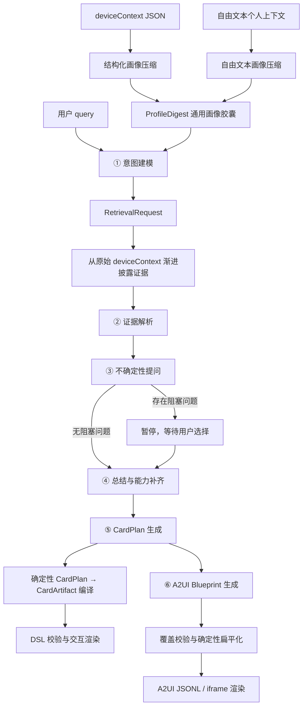

# cot-genui 当前全流程说明

> 实现基线：2026-08-17 工作区代码  
> 当前协议：ProfileDigest + CardPlan 单一协议 + A2UI Blueprint  
> 主流程：画像预处理 + 6 个可独立执行的推理阶段

本文描述当前代码实际执行的链路。`docs/DESIGN-DOC.md` 记录的是较早的 9 步设计，其中部分步骤、生成模式和文件职责已经发生变化；调试当前页面时应以本文和代码为准。

---

## 1. 系统目标

系统接收三类输入：

1. 用户当前请求 `query`；
2. 结构化设备上下文 `deviceContext`，或者一段自由文本个人上下文；
3. 用户对阻塞性不确定问题的选择题答案。

系统依次完成：

- 建立与 query 无关、可缓存的通用用户画像；
- 根据当前 query 定义任务、交付等级和任务槽位；
- 从原始画像中按需检索证据并解析槽位；
- 在生成前以选择题确认关键不确定项；
- 汇总已确认事实，并在需要时进行一次任务型联网搜索；
- 生成唯一的中间协议 CardPlan；
- 从同一份 CardPlan 分别生成 DSL CardArtifact 和 A2UI；
- 校验结构、内容覆盖率、动作和外链，必要时降级或修复。

---

## 2. 端到端架构



关键设计是：CardPlan 是 DSL 和 A2UI 的共同内容源。A2UI 不再绕开 CardPlan 独立构思业务内容，只负责把 CardPlan 做视觉编排。

---

## 3. 输入和页面状态

### 3.1 输入来源

| 输入 | 页面字段 | 用途 |
|---|---|---|
| 用户请求 | `query` | 决定当前任务目标 |
| 预设/可编辑 JSON | `contextText` | 画像压缩和第二步原始证据检索 |
| 自由文本画像 | `customContextText` | 长度超过 20 字时优先用于生成通用画像摘要 |
| 选择题答案 | `answers[index]` | 第四步前确定性写回相关槽位 |
| 分步模型 | `stepModels[step]` | 每一步均可在三档模型间切换 |

页面由 Zustand store 保存主状态：

- `profileDigest`：query-independent 通用画像；
- `inferenceState`：贯穿前四步的任务推断状态；
- `slots / conflicts / questions / answers`：解释性推理信息；
- `cardPlan`：唯一业务卡片中间协议；
- `compiledArtifact`：CardPlan 编译后的 DSL；
- `a2uiBlueprint / a2uiJsonl`：A2UI 原始视觉规划和编译结果；
- `steps`：每一步状态、模型、耗时、token、费用和调用日志。

### 3.2 修改输入时的失效规则

- 修改 JSON 上下文会清空画像、六步结果、CardPlan、DSL 和 A2UI；
- 切换预设会清空旧结果，并异步预热画像；如果仍保留超过 20 字的自由文本，画像入口优先使用自由文本而不是新预设 JSON；
- 修改某一步模型会把该步骤重置为 `pending`，但不会自动重跑后续步骤；
- 点击“重置全部”恢复默认 query、默认预设和默认模型组合；当前实现不会清空 `customContextText`。

---

## 4. 阶段 0：通用画像预处理

画像预处理不属于六步任务推理，它应当在用户画像变化时离线或预热执行一次，后续不同 query 复用。

### 4.1 结构化 JSON 画像

入口：`POST /api/profile/compress`

执行过程：

1. 对 JSON key 排序后稳定序列化，计算 SHA-256 `contextHash`；
2. 查询服务进程内的 `Map<contextHash, ProfileDigest>`；
3. 将嵌套 JSON 展平成 `{path, value, domain}` 原子记录；
4. 按顶层 domain 分组，每个 chunk 最多约 8,000 字符，最多 8 个 chunk；
5. 多 chunk 时并行执行领域 map 摘要，再执行一次 reduce；单 chunk 直接 reduce；
6. 生成 `ProfileDigest v1` 并写入进程内缓存；
7. 模型不可用或调用失败时，退化到确定性目录摘要，并标记 `degraded: true`。

结构化画像压缩固定使用：

| 参数 | 当前值 |
|---|---|
| 模型 | `glm-5.2` |
| Thinking | disabled |
| temperature | `0.1` |
| do_sample | `true` |

### 4.2 自由文本画像

入口：`POST /api/profile/compress-free-text`

页面在自由文本超过 20 字时优先走该入口。服务端最低校验是 10 字。当前固定使用 `glm-5.2 Thinking`、`temperature=0.15`，提取 core、traits、domains、salientSignals 和 conflicts；失败时返回只含 `free_text` 领域的降级摘要。

### 4.3 ProfileDigest 结构

```text
ProfileDigest
├── contextHash / version / generatedAt
├── core
│   ├── demographics
│   ├── homeAndWork
│   ├── household
│   ├── occupation
│   ├── financialPosture
│   ├── healthConstraints
│   └── persistentPreferences
├── traits[]
├── domains[]
│   └── name / summary / availableSignals / retrievalKeys / freshness
├── salientSignals[]
├── conflicts[]
└── degraded
```

ProfileDigest 的职责是告诉第一步“用户大致是谁、有哪些领域可查”，不是最终事实证据。最终槽位证据必须来自 query 本身、用户回答或第二步披露的原始记录。

### 4.4 当前缓存边界

画像缓存只存在于当前 Next.js 服务进程内：

- 相同画像在同一进程中可命中缓存；
- 服务重启、开发热更新或横向扩容实例切换后缓存会丢失；
- 当前没有数据库、Redis、持久化版本管理或过期策略。

---

## 5. 六步主流程

### 5.1 默认模型和采样参数

| 步骤 | 默认模型 | Thinking | temperature | do_sample |
|---|---|---:|---:|---:|
| ① 意图建模 | `glm-4.7-flash` | 关闭 | 0.8 | true |
| ② 证据解析 | `glm-4.7-flash` | 关闭 | 0.35 | true |
| ③ 不确定性提问 | `glm-5.2` | 关闭 | 0.25 | true |
| ④ 总结与能力补齐 | `glm-5.2` | 关闭 | 0.2 | true |
| ⑤ CardPlan 生成 | `glm-5.2` | high | 0 | false |
| ⑥ A2UI 生成 | `glm-5.2` | high | 0.4 | true |

页面允许把任意一步切换为：

- `glm-5.2 · Thinking`；
- `glm-5.2`；
- `glm-4.7-flash`。

选择 Thinking 时请求额外携带 `reasoning_effort: high`。如果 Flash 遇到 429、访问量过大或 rate limit，服务端自动用 `glm-5.2`、Thinking disabled 重试一次。

### 5.2 ① 意图建模

输入：

- `query`；
- 完整 `ProfileDigest`。

本步不读取整份原始 deviceContext。主要任务是：

1. 确定任务领域 `taskType`，例如旅行规划、饮食推荐；
2. 确定最终交付等级 `fulfillment.outcome`：
   - `ideas`：只需灵感或通用建议；
   - `verified_recommendations`：需要真实、可验证的具体推荐；
   - `actionable`：需要预约、购买、下单等可执行入口；
3. 从最终交付反推 `slotRequirements`；
4. 指定 `requestedDomains`；
5. 生成 `retrievalRequests`，供第二步回查原始记录；
6. 只把 query 明示值写成 `explicitValue`。

输出进入 `InferenceState`。所有明示槽位会立即生成高置信 slot，证据为 `query`；其余需求留待第二步解析。

### 5.3 ② 证据解析

若第一步判断 `needsContext=false`，本步直接跳过模型调用。

否则先执行确定性混合检索：

- 请求 domain 命中：`+8`；
- 请求 source path 前缀命中：`+12`；
- semanticQuery/slot 名关键词命中：每项 `+2`；
- date/time/recent/calendar 路径：`+1`；
- 最多返回 40 条记录、总 JSON 约 6,000 字符。

模型获得：query、第一步任务状态、已请求领域摘要、检索到的原始证据。它必须：

- 为每个 `slotRequirement` 返回一个 slot；
- 给出 value、evidence、source_record、confidence、status；
- 检测本任务相关冲突；
- 可以补充第一步遗漏但影响交付的 `discoveredRequirements`；
- 不在本步向用户提问，也不能替用户选择偏好。

未找到证据的必需槽位会被代码补成空值、0 置信度、`low` 状态。

### 5.4 ③ 不确定性提问

代码先确定哪些槽位必须澄清。槽位同时满足以下两类条件才进入提问：

1. 不确定：空值、`low`、`conflict` 或 confidence `< 0.75`；
2. 影响方案：required、blocking 或 weight `>= 3`。

如果没有关键不确定槽位，本步跳过模型调用。

如果存在，本步只生成最少量的阻塞性问题。约束包括：

- 所有问题必须是选择题；
- 每题 2–4 个简短、互斥选项；
- 可以把高度相关的槽位合并成一题；
- 最多保留 6 题；
- 模型漏问或输出无效选项时，代码为未覆盖槽位补默认选择题；
- 不允许把澄清延迟到最终 CardPlan/A2UI。

### 5.5 暂停和继续

“一键全部”按顺序执行前三步。第三步完成后：

- 如果每个问题已有答案，直接进入第四步；
- 如果还有未回答问题，设置 `runAllPaused=true`，页面按钮变成“继续生成”；
- 用户选择完所有答案后点击继续，才会执行第四至第六步。

第四步也会再次校验，任何未回答问题都会阻止继续。

### 5.6 ④ 总结与能力补齐

首先由代码把选择题答案确定性写回所有关联槽位：

- `source_record = user_answer`；
- `confidence = 1`；
- `status = high`；
- 模型不得覆盖这些确认结果。

随后代码根据 query 和已确认槽位修正 fulfillment：

- 自己做、菜谱、下厨 → `ideas`；
- 外卖、订餐、预约、购买、酒店等 → `actionable`；
- 推荐、吃什么、去哪、买什么等 → `verified_recommendations`。

若需要新鲜数据，或 outcome 不是 `ideas`，本步最多触发一次 GLM `web_search` 工具调用：

- 搜索词由任务类型、最多 10 个置信度 `>=0.7` 的槽位和交付目标组成；
- 请求搜索结果数量为 5，内容尺寸为 medium；
- 输出 `webFacts`、具体 `entities`、来源 URL、可选 action URL 和能力调用日志；
- 无法取得有效实体时应透明降级，而不是虚构。

`webFacts.entities` 是后续真实商家、景点、酒店、食品、预约页等内容的主要载体。

### 5.7 ⑤ CardPlan 生成

本步要求第四步已经产生 `summary`，否则拒绝生成。

模型根据完整 `InferenceState` 和用户答案生成 3–6 张 CardPlan 卡片。CardPlan 主要结构：

```text
CardPlan
├── skillName / iconText / reasoning
└── cards[]
    ├── id / purpose / sourceSlots
    ├── blocks[]
    │   ├── hero / summary / list / progress / status
    │   ├── metric / choice / toggle
    │   └── image / chart / infographic（编译时可能降级）
    └── actions[]
        ├── navigate / select / toggle / confirm
        ├── external-link
        └── copy / save / pick-file / ocr / llm-call / tool
```

服务端在接受模型结果后执行：

1. 基础结构校验；
2. 最多保留 6 张卡；
3. 修复缺失 card ID；
4. 把错误的 list `{title}` 归一化成 `{label}`；
5. 将非法 action role 降为 `secondary`；
6. 过滤不在 `webFacts` URL 集合内的 external-link；
7. 将 `webFacts` 中漏抄的实体、摘要和入口确定性补进 CardPlan；
8. 派生 Semantic Markdown 和 Mermaid 推理 DAG。

### 5.8 ⑥ A2UI 生成

输入只包含 CardPlan。模型负责视觉规划，不应重新决定业务事实。

每张 CardPlan card 必须对应一个同 ID surface，并声明：

- `sourceCardId`；
- `visualDirection`；
- `coveredBlockIndexes`；
- `coveredActionIds`；
- `root` 嵌套组件树。

允许的主要组件包括 Card、Column、Row、List、Text、Button、Image、ChoicePicker、Hero、Metric、Progress、Badge 和 Timeline。

确定性编译器会校验：

- 每张 CardPlan 卡是否有对应 surface；
- 所有 block index 是否覆盖；
- 所有 action id 是否覆盖；
- CardPlan list 的每个 label 是否实际进入组件树；
- external-link 是否精确转换为 `openUrl(action.link)`；
- 未知组件是否需要忽略并产生 warning。

通过后把嵌套 Blueprint 扁平化为 A2UI v0.9 消息：

- `createSurface`；
- `updateComponents`。

若第一次 Blueprint 结构或覆盖率校验失败，系统固定使用 `glm-5.2`、Thinking disabled、temperature 0 定向修复一次。第二次仍失败时，第六步返回错误，不渲染无效 A2UI。

---

## 6. CardPlan 到 DSL 的旁路

CardPlan 完成后，前端会异步执行 `enrichAndCompile()`：

```text
CardPlan
  → 扫描 missingInfo
  → 可选 /api/search 或 /api/llm 补齐
  → compileCardPlan
  → CardArtifact
  → validateArtifact
  → DslCardHost
```

当前第五步提示词已经禁止模型产生 `missingInfo`，所以正常六步链路通常直接编译。`missingInfo` 补齐器主要保留给手写 CardPlan、旧数据和 DSL demo。

确定性 DSL 编译器负责：

- CardPlan block/action 到 DSL block/action 的映射；
- flow 和 dsl 两侧 card ID 同步；
- 列表点击后的 state 写入和跳卡；
- initialState 与 binding；
- tool action 和 external-link；
- 每卡最多 5 个 block、3 个可见 action；
- image/chart/infographic 等领先能力的诚实降级和 notice。

校验器被异常保护包围，畸形 artifact 只返回诊断，不再导致页面因读取 undefined 而崩溃。它检查版本、startCardId、双侧卡片集合、template、transition、ID 唯一性、action 结果和 binding 等不变量。

---

## 7. 联网信息和 URL 流转

正常六步主链路的联网发生在第四步：

```text
GLM web_search 原始结果
  → 模型结构化为 webFacts/entities
  → CardPlan URL allowlist
  → external-link
  → DSL tool openUrl
  → A2UI functionCall openUrl
```

URL 只接受 `http` 或 `https`。CardPlan 模型自行新增、但未出现在 `webFacts` 的外链会被删除。资源卡优先使用 actionUrl，其次 sourceUrl，并根据 `order / reserve / details` 生成“去下单 / 去预订 / 查看”标签。

需要注意：当前 allowlist 来源仍是模型结构化后的 `webFacts`，而不是服务端从 provider 原始搜索结果中建立的不可伪造 source registry。因此它能防止第五、六步新增链接，但不能完全证明第四步给出的 URL 一定真实或可访问。

旁路 `/api/search` 也不是真正的搜索 API：它目前调用 `LLM_MODEL` 做 3–5 句知识问答，只适用于旧 `missingInfo` 兼容链路，不能视为实时联网事实来源。

---

## 8. 耗时、Token、费用和日志

每一步返回：

| 字段 | 含义 |
|---|---|
| `durationMs` / `timing.totalMs` | API route 内该步骤端到端墙钟时间 |
| `timing.llmMs` | 本步骤模型请求墙钟时间；A2UI 修复时为两次请求之和 |
| `timing.overheadMs` | `totalMs - llmMs`，包括编排、解析、校验和派生处理 |
| `providerCreatedAt` | 模型响应时间戳，不是推理耗时 |
| `usage.prompt` | 输入 token |
| `usage.completion` | 输出 token，可能包含 provider 统计的 reasoning token |
| `usage.cached` | provider 报告的缓存输入 token |
| `cost` | 按 `LLM_PRICING_JSON` 计算的估算费用 |

当前请求是非流式的，因此拿不到真实的首个推理 token 或首个正文 token 时延；`timeToFirstReasoningMs` 和 `timeToFirstContentMs` 只是预留字段。

每一步日志包含 request、response、error 和 fallback，页面展开步骤后可以查看模型、Thinking、temperature、do_sample、调用耗时、usage、响应形状和搜索元数据。

---

## 9. 一键全部状态机

```text
idle
  → ensureProfileDigest
  → ① intent_analysis
  → ② evidence_resolution（可能 skip）
  → ③ clarification（可能 skip）
      ├─ 有未回答问题 → paused
      │                  → 用户选择全部答案
      │                  → continueGenerate
      └─ 无未回答问题 ─────────────────────┐
                                           ↓
  → ④ context_enrichment（可能一次 web_search）
  → ⑤ card_plan_generate
       ├─ 异步 CardPlan → DSL 编译
       └─ ⑥ a2ui_generate
  → done
```

任一步返回 error 时，一键流程立即停止。用户也可以通过每一步左侧的 ▶ 独立重跑，但独立重跑上游后，调用者需要自行保证下游状态仍然与之匹配。

---

## 10. API 端点

| 端点 | 方法 | 当前职责 |
|---|---|---|
| `/api/profile/compress` | POST | 结构化 JSON 通用画像压缩 |
| `/api/profile/compress-free-text` | POST | 自由文本通用画像压缩 |
| `/api/infer` | POST | 执行六步中的指定一步 |
| `/api/search` | POST | 旧 missingInfo 的 LLM 知识问答旁路 |
| `/api/llm` | POST | 卡片内或 missingInfo 的普通文本生成 |

`/api/infer` 的主要请求体：

```json
{
  "query": "国庆带父母去北京怎么安排",
  "deviceContext": {},
  "step": "intent_analysis",
  "modelProfile": "glm_4_7_flash",
  "profileDigest": {},
  "inferenceState": {},
  "userAnswers": {},
  "cardPlan": {}
}
```

接口会根据 step 使用需要的字段。没有配置 `LLM_API_KEY` 时，六步返回 mock 结果以便调试页面。

---

## 11. 结果视图

右侧当前提供七种视图：

| 视图 | 数据源 | 说明 |
|---|---|---|
| DSL 卡片渲染 | `compiledArtifact` | CardArtifact 交互渲染和校验状态 |
| 堆叠卡片 | `result.cards` | 兼容旧结果结构；当前通常没有数据 |
| Semantic Markdown | `semanticMarkdown` | 从 CardPlan 确定性派生的可读文档 |
| CardPlan JSON | `cardPlan` | 当前唯一业务 IR |
| A2UI Visual Blueprint | `a2uiBlueprint` | 模型生成、编译前的嵌套视觉规划 |
| A2UI 卡片渲染 | `a2uiJsonl` | 编译后的 A2UI v0.9 消息渲染 |
| GLM Raw IR | `cardPlan` | CardPlan 原始 JSON 调试视图 |

中栏同时展示：

- 六步状态和模型选择器；
- 每步端到端耗时、LLM 耗时、应用开销、token、费用；
- request/response/fallback/error 日志；
- 槽位、证据和置信度；
- 冲突；
- 阻塞选择题；
- CardPlan 派生的 Mermaid 推理 DAG。

---

## 12. 环境变量

| 变量 | 用途 |
|---|---|
| `LLM_API_KEY` | 未配置时主流程使用 mock |
| `LLM_BASE_URL` | OpenAI-compatible 服务地址，例如 GLM endpoint |
| `LLM_MODEL` | `/api/llm` 和 `/api/search` 兼容旁路的默认模型 |
| `LLM_PRICING_JSON` | 按模型配置输入、输出、缓存 token 单价 |

`LLM_PRICING_JSON` 示例：

```json
{
  "glm-5.2": {
    "input": 0.8,
    "output": 2.0,
    "cachedInput": 0.2
  }
}
```

价格单位为美元/百万 token。`glm-4.7-flash` 当前内置了 0/0 占位价格，因此会显示 0；其他未配置价格的模型只展示 token，不猜测费用。

---

## 13. 当前已知边界

1. **画像缓存不持久化**：只在当前 Node 进程内有效。
2. **自由文本存在二级检索边界**：自由文本摘要能进入第一步，但第二步的 `retrieveProfileEvidence` 当前仍从 JSON `deviceContext` 取原始证据；若要完全支持纯自由文本，需要保存并检索其原文分块。即使填写了自由文本，当前主流程仍要求 JSON 编辑框保持合法。
3. **通用画像可能压缩掉反向信号**：当前只有 `conflicts`，尚未单独建模 tensions/counterSignals。
4. **URL 尚非强验证**：第四步模型结构化的 `webFacts` 仍可能包含不可访问或非官方 URL；没有服务端 sourceId、HEAD/GET 验证和官方域名评级。
5. **搜索预算固定为一次**：复杂任务无法自动进行多轮搜索、实体补查或交叉验证。
6. **A2UI 仍是非流式大 JSON 生成**：复杂 CardPlan 可能产生较长延迟；只有一次定向修复机会。
7. **DSL enrich 与 A2UI 可并行发生**：CardPlan 后的 `enrichAndCompile()` 是前端异步旁路，A2UI 使用第五步返回的 CardPlan；正常提示词禁止 missingInfo，因此通常一致，但旧 CardPlan 可能存在竞态。
8. **分步手动重跑没有自动依赖失效图**：修改上游步骤后，旧下游结果可能暂时仍显示，直到重新生成。
9. **旁路 `/api/search` 不是实时搜索**：生产使用时应替换为真实搜索服务。
10. **自由文本状态不会随“重置全部”清空**：它持续具有高于 JSON 预设的画像优先级；切换预设前应手动清空，或在后续实现中修正 reset 行为。

---

## 14. 关键实现文件

| 文件 | 职责 |
|---|---|
| `src/lib/profile.ts` | 画像哈希、压缩、缓存、降级、证据检索 |
| `src/lib/profileTypes.ts` | ProfileDigest 和 RetrievalRequest 类型 |
| `src/lib/pipeline.ts` | 六步模型调用、提示词、搜索、归一化、修复和计时 |
| `src/lib/pipelineTypes.ts` | 六步名称、模型档位、InferenceState、计时与 usage |
| `src/store/useInferStore.ts` | 页面状态机、一键暂停/继续、API 调用、DSL 编译触发 |
| `src/dsl/modules.ts` | CardPlan IR 类型 |
| `src/dsl/compiler.ts` | CardPlan → CardArtifact 确定性编译 |
| `src/dsl/validate.ts` | CardArtifact 渲染前不变量校验和异常边界 |
| `src/dsl/enrichPlan.ts` | 旧 missingInfo 兼容补齐旁路 |
| `src/lib/a2uiBlueprint.ts` | A2UI Blueprint 覆盖校验和 v0.9 编译 |
| `src/components/A2UIRenderer.tsx` | A2UI 多 surface 卡片渲染和动作执行 |
| `src/components/CotTrace.tsx` | 六步状态、耗时、日志、问题和 DAG 展示 |
| `src/app/api/infer/route.ts` | 六步统一 API 入口 |

---

## 15. 推荐的调试顺序

遇到结果不符合预期时，按以下顺序定位：

1. 检查 ProfileDigest 是否保留了相关 domain、signal 和冲突；
2. 检查第一步是否定义了足够原子化的 slotRequirements 和 retrievalRequests；
3. 检查第二步 `retrievedEvidenceCount`、披露领域和 source_record；
4. 检查关键低置信槽位是否在第三步被选择题覆盖；
5. 检查答案是否在第四步变成 `user_answer / confidence=1`；
6. 检查第四步 searchQuery、webFacts.entities、sourceUrl/actionUrl；
7. 检查第五步 CardPlan 是否包含业务实体、sourceSlots 和合法 actions；
8. 检查 DSL compile notices 和 artifact validation；
9. 检查第六步 coverage、compileWarnings 和 fallback 日志；
10. 最后检查渲染器，而不是先把内容缺失归因于渲染问题。
