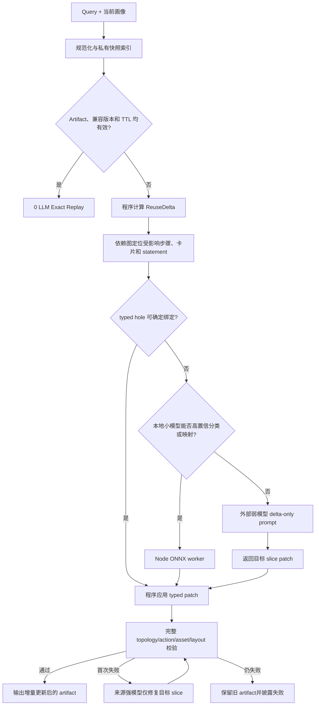

# 本地小模型增量推理 Alternative

> 状态：架构设计，当前阶段不接入或下载模型。  
> 首选运行时：Node.js + ONNX Runtime；接口需要允许后续迁移到 MindSpore Lite。

## 1. 目标与边界

本方案不是用百 MB 内的小模型替代 Qwen、GLM 等生成模型。这个体量的模型更适合完成 embedding、分类、排序、字段对齐和简单序列标注，无法可靠生成完整 CardPlan JSON 或 OpenUI 程序。

小模型的目标是把大量“是否相似、哪里变化、该走哪个模板”的判断移到本地，让程序先完成确定性复用，只将无法确定的局部差异交给外部 LLM：

- Skill 候选召回、意图分类和参数字段对齐在本地完成。
- 程序根据快照、画像 selector 和 provenance 计算真实增量。
- 可以直接绑定的字段由程序写入 CardPlan/OpenUI 模板。
- 小模型只处理分类、排序或映射，不生成最终 artifact。
- 外部弱模型只接收 unresolved delta，并返回目标 slice 的 typed patch。
- 完整强模型仅作为局部失败后的最后回退。

共享 Skill 中不保存用户值、画像正文、URL 或模型私有推理；本地模型也不改变现有 action、assetRef、raw URL 和 OpenUI validator 安全边界。

## 2. 推荐模型

首个候选为 `bge-small-zh-v1.5`：原模型约 24M 参数，适合中文 embedding、语义检索、相似度和基于 prototype 的轻量分类。Transformers.js 版本提供约 24MB 的 INT8 ONNX 权重，连同 tokenizer 仍可控制在百 MB 内。

- [BAAI/bge-small-zh-v1.5 模型说明](https://huggingface.co/BAAI/bge-small-zh-v1.5)
- [Xenova/bge-small-zh-v1.5 ONNX 权重](https://huggingface.co/Xenova/bge-small-zh-v1.5/tree/main/onnx)

它是 encoder，不是生成模型。初期只使用同一个模型服务以下任务：

1. Query 与 Skill invariant 的向量召回。
2. 当前参数名与 Skill 参数定义的语义对齐。
3. 当前画像字段与 `ProfileDependencyManifest.selector` 的匹配。
4. Web evidence、事实和卡片内容原子的相关性排序。
5. Card archetype、OpenUI composition 候选的 prototype 排序。

需要训练型分类器时，优先在 embedding 后增加很小的线性分类头或 prototype 集合，而不是再引入第二个大型模型。只有序列标注质量确实成为瓶颈时，再评估独立的 INT8 TinyBERT 类 token-classification 模型。

## 3. 在六步管线中的适用性

| 环节 | 小模型可处理 | 不应交给小模型 | 建议执行方式 |
|---|---|---|---|
| Skill 匹配前置 | embedding 召回、相似度、参数字段映射 | 最终高风险兼容决策 | 本地预筛；歧义区调用外部匹配模型 |
| ① Intent | intent 分类、参数 key 对齐、已知模板选择 | 开放式复杂意图拆解 | Skill 模板和规则优先，小模型做分类 |
| ② Evidence | selector 匹配、证据排序、冲突类别识别 | 读取外部数据、复杂冲突解释 | 宿主检索，程序绑定，小模型辅助排序 |
| ③ Clarification | 问题模板排序 | 自由生成长问题 | 直接使用确定性模板，通常无需模型 |
| ④ Enrichment | 搜索结果去重、相关性和事实片段排序 | 实时搜索、跨来源复杂综合 | 搜索仍由宿主执行，必要时弱模型综合 |
| ⑤ CardPlan | archetype 排序、内容原子分组、模板选择 | 生成完整 CardPlan JSON | 程序装箱和 typed-hole 绑定；弱模型仅补局部 patch |
| ⑥ OpenUI | composition 分类、组件候选排序 | 生成完整 OpenUI 源码 | 程序更新 AST/props；结构歧义时调用弱模型 |

小模型真正能缩短耗时的前提，是调用结果参与“跳过模型”或“缩小模型输入”，而不是在原有完整 LLM 请求之前额外增加一次推理。

## 4. 推荐执行架构



本地模型只位于程序化 delta 与外部弱模型之间。它不能绕过 validator，也不能直接修改完整 CardPlan 或 OpenUI。

## 5. Node ONNX 运行时设计

模型应运行在独立宿主 worker 中，而不是 Next.js route 每次请求重新加载：

- 首次使用时懒加载模型，加载 Promise 全局去重。
- 模型常驻内存，限制并发并合并短时间内的 embedding batch。
- 模型文件存放在运行时缓存目录，不提交到 Git，也不打入客户端 bundle。
- 模型不可用、校验失败或内存不足时直接返回 `unavailable`，主流程继续走现有外部模型路径。
- 记录加载时间、推理时间、输入长度、batch size 和命中后的实际跳过调用数。

建议定义与具体框架无关的接口：

```ts
interface LocalInferenceBackend {
  readonly backendId: "onnx-node" | "mindspore-lite";
  readonly modelRevision: string;

  embed(input: string[]): Promise<Float32Array[]>;
  classify(task: string, input: unknown): Promise<ClassifyResult>;
  tag(task: string, input: string): Promise<TagResult[]>;
  health(): Promise<LocalModelHealth>;
}
```

上层只能依赖此接口和标准化输出，不能直接依赖 Transformers.js tensor、ONNX session 或 tokenizer 实现。

## 6. MindSpore Lite 可移植性

为了后续迁移到 MindSpore Lite，模型包需要独立的 manifest：

```ts
type LocalModelManifest = {
  modelId: string;
  revision: string;
  tokenizerRevision: string;
  maxTokens: number;
  pooling: "cls" | "mean";
  normalize: boolean;
  inputNames: string[];
  outputName: string;
  embeddingDimensions: number;
};
```

移植约束：

- tokenizer、截断、padding、pooling 和 L2 normalize 必须由 manifest 明确，不使用框架默认值。
- ONNX 和 MindSpore Lite adapter 必须输出相同维度和相同归一化方式的向量。
- prototype、分类阈值和向量索引格式不依赖具体推理框架。
- 每次转换模型后运行同一组中英文 fixture，对 embedding cosine、top-k 排名和分类结果做一致性校验。
- 模型 revision、转换脚本 revision 和 tokenizer revision 一起进入缓存兼容哈希，避免静默混用。

## 7. 与真实增量推理的结合

仅接入 embedding 模型不会自动减少 weak-full/weak-delta 的时间。主流程必须同时完成以下改造：

1. 将通用 Skill identity 与参数值分离，例如 `travel_planning(destination)` 与 `destination=西安` 分别建立 fingerprint。
2. 根据实际读取的 selector 生成相关画像 hash，忽略无关历史记录和非语义时间戳。
3. 建立 slot/fact → CardPlan block → OpenUI statement 的 provenance dependency map。
4. 程序先计算 `ReuseDelta`，直接绑定日期、地点、预算、偏好等 typed holes。
5. weak-delta 使用独立 prompt，完全替换普通步骤 prompt，只发送变化字段、目标 slice 和 patch schema。
6. patch 合并后运行完整 validator；只有局部失败才回退来源强模型。

因此，小模型是“减少不确定项”的辅助层，程序化模板和 dependency-aware patch 才是速度提升的主体。

## 8. 诊断与评估

开发诊断应区分：

- `local-model-skipped`：程序已经可以确定性处理。
- `local-model-hit`：小模型高置信处理，并避免了外部调用。
- `local-model-low-confidence`：转交外部弱模型。
- `local-model-unavailable`：加载或运行失败，优雅回退。
- `patch-validation-failed`：小模型或弱模型结果未通过完整校验。

评估不能只统计小模型准确率，还必须统计它是否真正减少外部模型工作：

- 外部 LLM 调用数和跳过调用数。
- delta payload 相比 full payload 的字符数与 token 降幅。
- 外部模型 TTFT、生成时间和总耗时。
- 程序 patch、小模型 patch、弱模型 patch 和强模型 fallback 的比例。
- 错误复用率、validator 拒绝率和最终 artifact 一致性。

## 9. 分阶段落地建议

1. **先实现程序化 delta**：稳定快照 hash、typed holes、dependency map 和 delta-only prompt。
2. **预留后端接口**：加入 `LocalInferenceBackend`、manifest、diagnostics 和 mock backend，不下载真实模型。
3. **离线评估模型**：用真实 Skill/query fixture 测量 BGE 的召回、参数映射和阈值。
4. **可选接入 Node ONNX**：仅在能够显著减少外部调用时启用 feature flag。
5. **验证 MindSpore Lite adapter**：转换同一模型并运行跨后端 conformance fixtures。

当前阶段建议完成前两项的架构准备；真实小模型下载、运行时依赖和默认启用留到程序化增量链路稳定之后。
