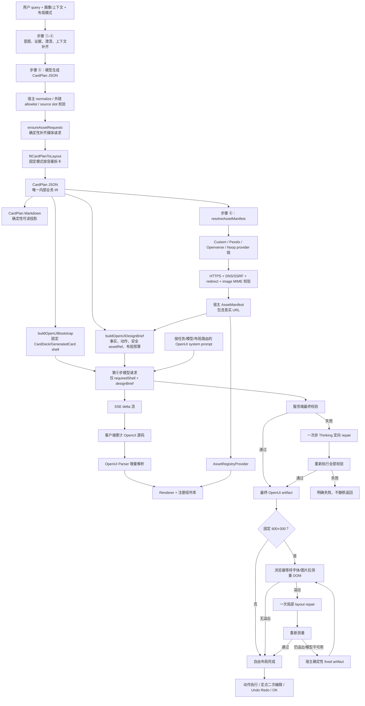

# OpenUI 在当前项目中的运作流程与原理

> 适用代码状态：2026-08-25。本说明以仓库当前实现为准，重点描述第⑤步 CardPlan 与第⑥步 OpenUI 的边界、流式渲染、安全校验、图片资产和固定布局闭环。

## 1. OpenUI 在项目中的定位

本项目没有让模型直接输出 React、JSX 或 HTML。OpenUI 是第⑥步使用的一种受组件库约束的声明式 UI 语言：模型输出一组“变量赋值 + 组件调用”语句，`@openuidev/react-lang` 负责持续解析这些语句，再用宿主注册的 React 组件渲染。

OpenUI 只负责最终视觉表达，不负责重新理解用户意图。业务事实、卡片数量和顺序、动作能力、图片归属都先由 CardPlan 确定；第⑥步模型可以自由组织卡片内部布局，但不能改变这些业务边界。

可以把职责概括为：

- CardPlan 决定“有哪些卡、每张卡必须表达什么、允许做什么”。
- 宿主决定“哪些图片和外部动作可信、哪些组件可用、布局是否合格”。
- OpenUI 模型决定“在上述边界内如何把每张卡设计出来”。
- Renderer 决定“如何把声明式语句变成真实 React UI”。

## 2. 端到端流程



## 3. 第⑤步：先确定业务拓扑，再谈视觉

### 3.1 CardPlan 是唯一内部业务 IR

`card_plan_generate` 让模型返回结构化 CardPlan JSON。它包含：

- `cards[]`：卡片 ID、简短标题、purpose、展示意图和数据块；
- `actions[]`：动作 ID、标签、类型、角色以及受控参数；
- `assetRequest`：图片查询、数量、用途和画幅；
- `layoutPolicy`：自由布局或固定 600×300；
- `sourceSlots`：事实与前面推理结果的来源关系。

模型返回后，宿主还会进行结构规范化、外链 allowlist 过滤和来源槽校验。CardPlan 因此不是未经处理的模型原文，而是后续所有校验的事实源。

### 3.2 CardPlan Markdown 只是可读投影

`cardPlanToVibeMarkdown()` 从规范化后的 CardPlan 确定性生成 CardPlan Markdown，用于预览、复制和诊断。它不再作为第⑥步的模型输入，也不是另一份需要保持同步的业务 IR。

图片解析结束后会再次投影 Markdown，以安全方式显示图片请求的 accepted assetRef 或失败阶段，但不会显示真实图片 URL。

### 3.3 图片请求与固定布局预处理

如果模型遗漏了明显需要媒体的卡片，`ensureAssetRequests()` 会根据卡片 purpose、presentation 和内容实体确定性补齐，最多补两个请求，不增加 LLM 调用，也不因图片增加卡片。

固定模式下，`fitCardPlanToLayout()` 会在进入第⑥步之前按真实 CSS 容量模型拆分语义原子。事实、动作、图片请求、来源和稳定 ID 会被带到续卡中；第⑥步不能自行增删卡片来解决溢出。

## 4. 第⑥步模型实际收到什么

首次生成的 user payload 只有两个顶层字段：

```ts
{
  requiredShell,
  designBrief,
}
```

### 4.1 requiredShell：宿主锁定卡片拓扑

`buildOpenUIBootstrap()` 确定性生成根节点和每张卡的壳，例如：

```text
root = CardDeck([card_0, card_1], "auto")
card_0 = GeneratedCard("card_list", "国内悦榕庄", [card_0_body], "standard", "balanced")
card_1 = GeneratedCard("card_detail", "目的地详情", [card_1_body], "media", "immersive")
```

模型只能补全 `card_0_body`、`card_1_body` 等依赖语句。卡片数量、顺序、`cardId` 和标题由宿主提供，不由第⑥步自由改写。固定模式还会强制 compact density。

### 4.2 designBrief：机器可读、可渲染的最小上下文

`buildOpenUIDesignBrief()` 为每张卡提供：

- `purpose`；
- 去重后的可见事实、指标和选项；
- 非可见的 `designIntent`；
- 已验证图片对应的安全 `assetRef`、role、aspect、requestId；
- 必须原样使用的 `actionRef`；
- 固定模式下的高度预算和允许 composition。

它不包含 CardPlan JSON、CardPlan Markdown、图片 URL、provider、license 或宿主外链。文本中的原始 HTTP(S) 地址也会先被替换为宿主占位语义。

## 5. System Prompt 与组件库如何生成

运行时组件库由 `createLibrary()` 创建，根组件固定为 `CardDeck`。它组合了：

- 官方 `@openuidev/react-ui` 组件；
- 项目语义组件，如 `Timeline`、`ComparisonGrid`、`MetricRow`、`MediaHero`；
- 安全媒体组件 `AssetImage`、`AssetGallery`；
- 宿主动作组件 `HostActionChip`、`HostActionItem` 等；
- 固定模式专用的 `Fixed*` 有界组件。

`npm run generate:openui` 使用 OpenUI CLI 从这些库生成 JSON spec。运行时再由 `generateSystemPrompt()` 动态构造 system prompt，而不是读取一份手写的 `system-prompt.txt`。

Prompt 会按三项路由：

1. `taskFamily`：general、planning、recommendation、analysis；
2. 模型能力：compact 或 expanded；
3. `layoutMode`：固定模式直接使用独立 fixed spec 和 fixed examples。

因此，Renderer 可以注册完整运行时库，而给较弱模型的提示词只暴露更小的 palette；固定模式则只暴露容量明确的组件组合。

## 6. OpenUI 语句如何变成 React UI

OpenUI artifact 是引用式声明语言。每条 assignment 创建一个节点，其他节点通过变量名引用它；`root` 是整个依赖图入口。`createParser()` 使用生成的 library schema 检查组件名、参数和引用关系，`Renderer` 再把解析出的节点交给对应 React component。

客户端把 `Renderer` 放在 `AssetRegistryProvider` 内，并传入：

- `response`：当前累计的 OpenUI 源码；
- `library`：项目注册的组件库；
- `isStreaming`：允许不完整语句在流结束前继续补齐；
- `onAction`：把组件动作交回宿主；
- `onParseResult/onError`：记录首个 root 和渲染诊断；
- `toolProvider={null}`：明确关闭 OpenUI 工具调用。

`GeneratedCard` 在 body 尚未形成时显示 skeleton；一旦 parser 得到可渲染 root，卡片会随着后续语句逐步丰富。

## 7. 流式生成机制

开始第⑥步时，Zustand store 会立即把右侧视图切到 OpenUI，并发送 `stream: true`。`/api/infer` 返回 `text/event-stream`：

- `delta`：模型新增的 OpenUI 文本和累计字符数；
- `done`：最终完整 artifact、CardPlan 投影、manifest 和 diagnostics；
- `error`：错误和调用日志。

客户端逐个追加 delta，`Renderer` 对累计源码做增量解析。服务端校验发生在完整模型响应之后；若初稿需要 repair，用户可能先看到初稿的流式过程，随后 `done` 中的已修复完整源码会成为最终状态。

当前服务端没有发送独立的 `bootstrap` SSE 事件；界面是在请求开始时直接切换，并等待模型流中出现第一个可解析 root。

## 8. 最终 artifact 的宿主校验

`validateOpenUIArtifact()` 不依赖模型自报正确，而是解析真实 OpenUI 树并执行以下检查：

1. 必须存在 root，且 root 必须为 `CardDeck`；
2. 程序不能截断，不能有 unresolved reference 或 parser error；
3. 禁止 Query/Mutation 和 OpenUI tool call；
4. 禁止未经允许的内置动作和任何 raw external URL；
5. 可见文案不能泄漏“感觉与节奏”、archetype、density 等设计元数据；
6. `CardDeck` 直属子项只能是 `GeneratedCard`；
7. 卡片数量、顺序和 cardId 必须与 CardPlan 完全一致；
8. 每个 CardPlan actionRef 必须恰好出现一次；
9. assetRef 必须来自 manifest，属于正确卡片，并覆盖已成功解析的媒体请求；
10. 固定模式的 AST 必须满足组件容量账本和组合约束。

初稿失败时，服务端只进行一次非 Thinking repair。repair 收到 required shell、当前源码、错误、缺失动作/资产和布局违规，不会再次发送 CardPlan Markdown。修复后重新执行全部校验；仍失败则第⑥步明确报错。

## 9. 图片为什么必须经过宿主

图片检索不是 OpenUI 模型工具。链路是：

```text
CardPlan assetRequest
  → Custom / Pexels / Openverse provider
  → 标准化 ImageCandidate
  → HTTPS、DNS/SSRF、redirect、MIME 校验
  → AssetManifest（宿主持有 URL）
  → SafeAssetRef（模型只看到 ID 和语义）
  → AssetImage / AssetGallery / MediaHero
  → AssetRegistry 查询真实 URL 并渲染 
```

URL 校验优先尝试 HEAD；当 HEAD 不支持、返回 403/405/501 或缺少 content-type 时，再做有超时和 Range 限制的 GET。每次重定向都会重新检查 HTTPS 与目标 DNS，私网、保留地址和不安全跳转会被拒绝。

真实 URL、provider 和授权元数据只保存在宿主 `AssetManifest`。模型看到的 `SafeAssetRef` 只有 ID、alt、cardId、requestId、role 和 aspect，所以生成结果只能通过 `AssetImage(assetRef)` 等组件取图，不能绕过 registry 拼接 URL。

当 provider 未配置、报错、零结果或候选未通过校验时，系统保留结构化 diagnostics 并优雅降级为无图卡片。只有已经 accepted 的请求才成为第⑥步必须覆盖的媒体要求。

## 10. 动作为什么也是宿主能力

CardPlan action 会被编码成稳定引用：

```text
plan:<encoded-card-id>:<encoded-action-id>
```

模型只能把该值原样交给 `HostAction*` 组件，不能自行声明购买、导航、复制或网络能力。点击后，Renderer 的 `onAction` 把引用交回 `OpenUIRenderer`，宿主再从 CardPlan 反查动作：

- `external-link` 再做 HTTP(S) 检查后用 `noopener,noreferrer` 打开；
- `copy` 由宿主写入剪贴板；
- `navigate` 和其他动作目前以宿主反馈处理，后续可在这一层接入真实能力。

未知或伪造的 actionRef 会被拦截，且不会直接执行模型提供的代码。

## 11. 两种布局模式

| 模式 | CardPlan 阶段 | 第⑥步组件约束 | 浏览器最终检查 |
| --- | --- | --- | --- |
| `free` | 不按固定高度拆卡 | 按任务与模型选择 compact/expanded palette | 宿主容器正常滚动，不做卡片高度 repair |
| `fixed-600x300` | 按容量账本拆成任意数量续卡 | 独立 fixed spec；只允许有界组件和受控 composition | 字体、图片稳定后测量 600×300 卡片，禁止卡内滚动和截断 |

固定模式先做静态 AST 校验，再由 `ResizeObserver` 读取卡片/header/body 的 `clientHeight`、`scrollHeight` 和横向尺寸。出现真实 DOM 溢出时：

1. `/api/openui/layout-repair` 只接收溢出卡片的 dependency slice、局部 design brief 和测量值；
2. 使用当前第⑥步模型的非 Thinking 模式改写目标 assignment；
3. 合并后重新执行完整安全与拓扑校验；
4. 若模型不可用、repair 失败或复测仍溢出，改用宿主 `buildDeterministicFixedOpenUI()`；
5. 只有复测稳定后，OK 和二次编辑才可用。

## 12. 卡片局部编辑

用户开启 targeting mode 后，页面会记录目标 cardId、卡内归一化坐标、像素坐标、附近文字和元素提示。`/api/openui/edit` 不重跑六步：

1. 从当前 artifact 中提取目标卡片的 dependency slice；
2. 从 CardPlan Markdown 提取目标卡片段落作为局部业务上下文；
3. 只允许 patch 目标 editable IDs，禁止引用其他卡片 statement；
4. 合并 patch 后重新校验完整 artifact；
5. 成功后形成新版本，并支持 Undo/Redo。

固定模式每次编辑后会重新进入 DOM 稳定化流程。编辑失败不会覆盖当前可用版本。

## 13. 可观测性与主要产物

| 产物 | 作用 | 是否含真实 URL | 是否发送给第⑥步模型 |
| --- | --- | --- | --- |
| CardPlan JSON | 唯一内部业务 IR、动作与拓扑事实源 | 可能含经过 allowlist 的 action link | 否 |
| CardPlan Markdown | CardPlan 的人类可读投影 | 否 | 否 |
| requiredShell | 固定 CardDeck/GeneratedCard 拓扑 | 否 | 是 |
| designBrief | 最小可渲染事实、动作、安全图片引用和布局预算 | 否 | 是 |
| AssetManifest | 宿主图片注册表 | 是 | 否 |
| OpenUI source | 最终可解析声明式 UI | 禁止 | 模型输出 |
| openuiDiagnostics | parser、覆盖率、质量、图片和布局状态 | manifest 仅留在宿主响应内 | 否 |

开发环境的 OpenUI 视图会显示：

- 流式耗时：请求、首 delta、首 root、done；
- 图片解析：provider state、requests、candidates、accepted、rejected、required、used 及逐阶段原因；
- 图片采用：available/referenced/resolved、使用图片的卡片数、未使用 assetRef；
- 固定布局：planned/static/measured、repair 和 fallback 状态；
- Renderer parser/error diagnostics。

## 14. 关键文件索引

| 领域 | 关键文件 |
| --- | --- |
| 六步编排 | `src/lib/pipeline.ts` |
| 推理 API 与 SSE | `src/app/api/infer/route.ts` |
| CardPlan schema/normalize/prompt | `src/dsl/modules.ts`、`src/lib/cardPlanNormalize.ts`、`src/lib/cardPlanPrompt.ts` |
| CardPlan Markdown | `src/openui/vibeMarkdown.ts` |
| 宿主 shell 与模型 payload | `src/openui/bootstrap.ts`、`src/openui/designBrief.ts`、`src/openui/payload.ts` |
| Prompt 路由与 spec | `src/openui/promptRouting.ts`、`src/openui/generated/*.spec.json` |
| 运行时组件库 | `src/openui/library.tsx`、`src/openui/components/*` |
| Parser 与最终校验 | `src/lib/openui.ts`、`src/openui/assetCoverage.ts`、`src/openui/layoutValidation.ts`、`src/openui/designLeakage.ts` |
| 图片解析与安全 registry | `src/openui/assetResolver.ts`、`src/openui/providers/*`、`src/openui/assetContext.tsx` |
| 客户端流式状态 | `src/store/useInferStore.ts` |
| React 渲染与 DOM 测量 | `src/components/OpenUIRenderer.tsx` |
| 固定布局 repair | `src/app/api/openui/layout-repair/route.ts`、`src/openui/fixedArtifact.ts` |
| 局部编辑 | `src/app/api/openui/edit/route.ts`、`src/openui/editSlice.ts`、`src/openui/editPrompt.ts` |

## 15. 开发与验证

组件或 prompt palette 改动后先重新生成 spec：

```bash
npm run generate:openui
```

常规验收：

```bash
npm test
npm run lint
npm run build
```

固定布局浏览器测试：

```bash
npm run test:layout
```

图片服务可单独运行与验证：

```bash
npm run dev:image-gateway
npm run demo:image-gateway:openverse
npm run smoke:openui-assets
```

## 16. 一句话总结

当前项目中的 OpenUI 是一个“模型负责受限构图、宿主负责事实边界与执行安全、Renderer 负责增量解释”的 UI 编译链：CardPlan 锁定业务，safe brief 限制输入，OpenUI Lang 表达视图，完整校验和浏览器实测负责把概率性生成收敛成可执行、可观察、可修复的 React 卡片。
