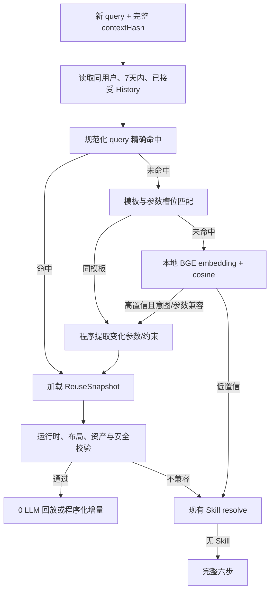

# 私有语义 History 缓存方案与当前状态

> 更新日期：2026-09-01  
> 状态：**设计已确定，尚未实现**。本文用于保存后续实现边界；本轮 Stitch MVP 不引入 History 表、Embedding 模型或匹配逻辑。

## 1. 目标

在现有 Skill 与 `ReuseSnapshot` 之上增加仅属于当前用户的 History 层，用于 TTL 内的高概率重复任务：

1. 对新 query 进行本地语义匹配，优先复用用户已经点击 OK 的完整结果，尽量在调用外部 LLM 前命中。
2. 对反问及答案建立索引；再次遇到同义问题时自动预选历史答案，但仍要求用户确认。
3. History 保存具体用户值和完整运行结果；Skill 只保存可分享的通用契约，两者不能互相泄露。

## 2. 当前基础与缺口

当前 IndexedDB 数据库为 `cot-genui-learning`，schema version 4，已经包含：

- `taskRuns / stepRuns / artifacts / artifactContents / artifactLinks`：完整任务与步骤 provenance；
- `skills / skillVersions / skillExamples / skillCandidates / skillAccelerators`：可分享 Skill；
- `reuseSnapshots`：仅接受且通过安全校验的私有结果快照；
- `profileDigests`：按完整 `contextHash` 缓存画像摘要。

现有加速器已经支持同一规范化 query 的哈希匹配、相关画像比较、Skill invocation 匹配、运行时兼容检查和增量执行。但仍有两个明显缺口：

- `findReuseSnapshot()` 首先按 query SHA 精确查询；同义改写无法在调用外部抽象/Skill 匹配模型之前命中。
- clarification answers 目前只作为运行 artifact 保存，没有独立 TTL、语义索引和可查询的“问题—答案”记录。

因此，History 不是替换 `ReuseSnapshot`，而是为它增加一个本地语义入口，并给反问增加独立索引。

## 3. 固定策略

| 项目 | 决策 |
|---|---|
| 用户隔离 | 使用完整画像 `contextHash` 作为私有身份边界；画像任意变化即进入不同 History 空间 |
| 数据来源 | 只索引用户点击 OK 且全部安全校验通过的任务 |
| TTL | Query History 与 Answer History 均为 7 天 |
| 实时信息 | 速度优先，TTL 内允许回放；界面必须提示“实时信息可能已变化” |
| 语义模型 | 本地 `Xenova/bge-small-zh-v1.5`，Transformers.js / Node，INT8 目标约 24 MB |
| 降级 | 模型未下载、加载失败或不支持时退回规范化文本与词法匹配 |
| 反问答案 | 命中后仅预选，必须由用户确认；不得静默跳过反问 |
| 导出 | History 原文、Embedding、画像指纹和答案不得进入 Skill package |

## 4. 建议的数据结构

```ts
interface QueryHistoryRecordV1 {
  id: string;
  formatVersion: "genui-query-history/1";
  userContextHash: string;
  sourceRunId: string;
  reuseSnapshotId: string;
  normalizedQuery: string;          // private
  queryTemplate?: string;           // 例如：旅游(destination={destination})
  intentKey?: string;
  parameters: Array<{ key: string; valueKind: string; value?: string }>;
  embedding?: number[];             // private
  embeddingModel?: string;
  requiresFreshData: boolean;
  acceptedAt: string;
  expiresAt: string;
  lastUsedAt?: string;
  hitCount: number;
}

interface ClarificationAnswerHistoryV1 {
  id: string;
  formatVersion: "genui-clarification-history/1";
  userContextHash: string;
  intentKey?: string;
  normalizedQuestion: string;
  questionTemplate?: string;
  questionEmbedding?: number[];      // private
  slotKeys: string[];
  optionSignature?: string;
  answerValue: unknown;              // private
  answerLabel?: string;
  sourceRunId: string;
  confirmedAt: string;
  expiresAt: string;
  lastUsedAt?: string;
  hitCount: number;
}
```

Dexie 后续升级到 version 5，新增：

```text
queryHistory:
  id,userContextHash,expiresAt,lastUsedAt,intentKey,
  [userContextHash+expiresAt],[userContextHash+intentKey]

clarificationHistory:
  id,userContextHash,expiresAt,intentKey,
  [userContextHash+expiresAt],[userContextHash+intentKey]
```

Embedding 不适合由 IndexedDB 普通索引直接检索。MVP 在读取同一 `userContextHash` 且未过期的有界候选后，于内存计算余弦相似度；达到规模阈值后再考虑 HNSW/SQLite，而不是一开始引入向量数据库。

## 5. Query 匹配流程



建议门槛：

- 规范化 query 完全一致：直接进入现有快照安全检查。
- `queryTemplate + intentKey` 一致：由程序比较参数变化，不把旧参数事实直接复用。
- BGE cosine ≥ 0.90 且 intent/参数结构兼容：进入候选；0.84–0.90 只作为 Skill resolve 的本地候选，不直接回放。
- 最终是否回放仍由现有 runtime、layout、profile、freshness 和 OpenUI validator 决定，语义相似度不能绕过安全门。

## 6. 反问答案匹配流程

1. 第③步得到问题后，以 `userContextHash + intentKey` 读取未过期答案候选。
2. 依次比较 slotKeys、问题模板、选项签名和问题 embedding。
3. 硬冲突、选项集合变化或答案已不在选项中时不命中。
4. 命中时在 UI 中预选，并显示“来自 N 天前的已确认回答”。
5. 用户再次确认后才继续④；确认行为刷新 `lastUsedAt/hitCount`，但不延长原始 7 天有效期。
6. 用户改选时保存新记录，并将旧记录标记为被替代，避免下一次继续推荐过期偏好。

## 7. API 与运行位置

建议新增 `/api/history/embed`，只接受短文本数组并返回 embedding；模型文件运行在本地 Node 进程，不调用第三方 LLM。浏览器负责 IndexedDB 查询和 History 隔离，服务端不保存用户历史正文。

为了避免首次加载阻塞：

- 精确匹配与模板匹配先运行；
- 只有未命中时才懒加载 BGE；
- 首次模型下载显示明确状态并允许跳过；
- embedding 以 `model + normalizedTextHash` 缓存；
- 每次只重算新增记录，已接受历史异步入索引。

## 8. 可观察性

后续 UI 增加 History 诊断区，至少显示：

- `exact / template / semantic / miss` 命中类型；
- 候选数量、最高相似度和阈值；
- contextHash/TTL/运行时校验是否通过；
- 实际跳过的 LLM 调用和节省 token/时间；
- clarification 是“历史预选”还是“用户本次确认”；
- 未命中的明确原因，但不展示原始画像、Embedding 或模型私有思维链。

## 9. 实施顺序

1. 新增 schema v5、记录写入、TTL 清理和用户隔离测试。
2. 接入接受事件：同时生成 `ReuseSnapshot` 与 `QueryHistoryRecordV1`。
3. 实现 exact/template 匹配，不引入模型即可先获得稳定收益。
4. 接入本地 BGE、懒加载、embedding 缓存和词法降级。
5. 在第③步接入 clarification 预选与强制确认。
6. 增加 History UI、诊断、删除/清空入口及性能基准。

## 10. 验收标准

- 同一 `contextHash`、同义 query、7 天内已接受结果可在外部 LLM 调用前命中。
- 画像任一变化都不能跨 History 空间读取记录。
- 未点击 OK、已过期、校验失败或运行时不兼容的结果不能回放。
- 实时任务回放时始终显示新鲜度警告。
- 历史反问答案只能预选，确认前不进入下一步。
- 本地 BGE 不可用时功能正确降级，主生成链不被阻塞。
- Skill 导出包不包含 History 原文、具体参数值、答案、Embedding 或私有快照。

## 11. 当前未实施项

截至本文日期，代码库中尚不存在 `queryHistory`、`clarificationHistory`、`/api/history/embed`、本地 BGE 依赖或 History UI。现有 `reuseSnapshots` 和 clarification artifacts 保持原状。本方案将在 Stitch MVP 评估之后单独进入实现，避免两个实验方向互相污染。
