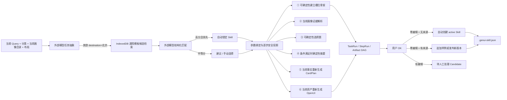

# 生成任务与 Skill 存储、匹配和复用架构

当前实现覆盖 TaskRun 全链捕获、SkillRecipe v3、参数化外部匹配、受控步骤复用、零编辑自动发布、跨用户导入导出和版本回滚。复用是六步管线外围的可关闭优化，不改变 CardPlan/OpenUI 安全契约。

## 数据流

## 匹配规则

外部模型先把当前 query 拆为稳定 `intentKey`、不变量和 runtime 参数；本地再按 intent、参数结构、任务分类和兼容性检索候选。宿主最多将 24 个脱敏索引摘要发送给用户选择的 Qwen 27B 或 GLM-5.2。第二阶段只接收结构化 abstraction，不再接收原 query；两个请求均不包含 recipe、设备原文、历史槽位值、图片、URL 或 OpenUI 源码。

有 abstraction 时，本地结构分优先比较 intent template 与参数 key/type；最终分数由外部模型 70% 和宿主结构分 30% 组成。模型 ID、参数映射和步骤名都必须通过宿主 allowlist。最高分不低于 0.82、领先第二名至少 0.08、无冲突且判定 compatible 时自动应用；0.62–0.82 只展示建议。抽象失败回退旧词法匹配，第二阶段失败则回退已抽象的本地结构分。

## 受控复用边界

- ①：模板与参数映射完整时，可直接建立 InferenceState 骨架并绑定当前 query 明示值；出现新参数或冲突则降级 guided。
- ②：始终读取当前用户画像和当前证据，Skill 仅提示领域和槽位。
- ③：只有模板以 2–4 个选项覆盖全部关键不确定槽位时才跳过模型。
- ④：仅在无需新鲜事实/搜索、问题已回答且关键槽位高置信时跳过模型。
- ⑤：始终根据当前事实生成 CardPlan，Skill 只提供卡片模式先验。
- ⑥：始终重新解析资产并生成 OpenUI，Skill 只提供允许的组件/媒体偏好。

每一步都可单独关闭复用。确定性执行条件不满足时，同一请求自动回退原始模型步骤，并在 StepRun、UI 徽章和输出 diagnostics 中标记。

## SkillRecipe v3 与隐私

v3 新增无值的 `intentTemplate`。例如分享包只保存 `travel_planning(destination)`，当前 `destination=北京` 存在私有 `SkillInvocation` artifact 中。recipe 继续保存 fulfillment、槽位定义、运行时画像绑定、澄清模板、freshness/capability policy、CardPlan 模式和组件偏好，不保存具体值、query 原文、画像正文、URL、图片、OpenUI 源码、API key 或隐藏 reasoning。

v1/v2 recipe 在读取和导入时内存升级为 v3；新导出统一为 `genui-skill/3`。匹配详情保存经校验的结构化决策依据，不请求、展示或持久化私有 CoT。

## IndexedDB

数据库名 `cot-genui-learning`，由 Dexie 管理：

- `episodes`、`policies`、`policyObservations`、`settings`
- `taskRuns`、`stepRuns`
- `artifacts`、`artifactContents`、`artifactLinks`
- `skills`、`skillVersions`、`skillExamples`、`skillCandidates`

正文按 SHA-256 去重。TaskRun 记录匹配分数、版本、recipe hash、逐步开关；StepRun 记录 normal/guided/deterministic/fallback、避免的调用数和回退原因。IndexedDB 捕获为 best-effort，失败不阻塞生成。

## 代码入口

- `src/learning/skillMatcher.ts`：本地匹配与阈值。
- `src/learning/queryAbstraction.ts`：参数化任务抽象 schema 与显示。
- `src/learning/skillRecipe.ts`：v3 schema、v1/v2 升级和逐步投影。
- `src/lib/skillReuse.ts`：服务端校验及①③④确定性执行。
- `src/learning/workflowCapture.ts`：TaskRun/StepRun/artifact 和候选提炼。
- `src/learning/skillPackage.ts`：自动发布、版本 delta、回滚和安全导入导出。
- `src/components/learning/SkillCenter.tsx`：Skill 管理界面。
