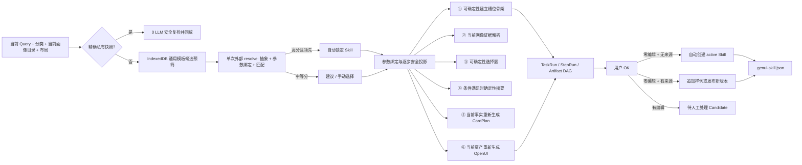

# 生成任务与 Skill 存储、匹配和复用架构

当前实现覆盖 TaskRun 全链捕获、SkillRecipe v3、参数化外部匹配、受控步骤复用、零编辑自动发布、跨用户导入导出和版本回滚。复用是六步管线外围的可关闭优化，不改变 CardPlan/OpenUI 安全契约。

## 增量推理加速层

用户接受结果后会同时沉淀两类隔离产物：

- `SkillExecutionCapsuleV1` 是可分享的任务契约，保存参数角色、逐步输入、CardPlan/OpenUI 结构模板和 validators，不包含用户值、画像正文、URL 或模型私有推理。
- `ReuseSnapshotV1` 只保存在本机 IndexedDB，保存通过安全校验的 CardPlan、OpenUI、相关画像依赖指纹和冷启动基线，不进入 Skill package。

生成前先按 `query + context + layout + runtime` 复合索引查询快照。完全一致时仅重新运行 OpenUI 与资产安全校验，不调用 LLM。未完全命中时，单次 `/api/skills/resolve` 同时完成任务抽象、参数绑定与最终 Skill 决策，并按 `relevant-exact / profile-compatible / skill-only / cold` 分别选择回放、确定性执行、弱模型增量或冷启动。弱模型失败只回退当前步骤。

IndexedDB v3 新增 `reuseSnapshots`、`skillAccelerators` 和 `profileDigests`；v4 为快照增加 generic invocation 复合索引，分别负责私有回放、capsule/version 索引和跨刷新画像摘要缓存。

### Typed Delta v2

复用索引会同时保存规范化 query、包含参数值的 binding fingerprint 和不含参数值的 generic invocation fingerprint。因而 `travel_planning(destination=北京)` 与 `travel_planning(destination=西安)` 可以命中同一通用 Skill，但北京的事实和图片不会被直接复制到西安任务。

查询快照不再静默返回 miss，而会记录 query、相关画像、硬约束、布局、运行时版本、TTL 和安全校验的逐项 trace。实时事实过期、OpenUI spec 变化或布局变化只会使依赖它们的步骤失效，不再丢弃整份快照。快照回放优先使用已经验收的私有 AssetManifest，避免图片 provider 临时超时把 0 LLM 回放打回冷启动。

`ReuseDeltaV1` 在宿主中比较参数、画像 selector、freshness 和 runtime stamp，并沿 `sourceSlots` 定位受影响卡片。未受影响步骤直接 replay；⑤通过 typed card patch 更新目标卡片且保留原 action topology；⑥只发送目标卡片的 OpenUI statement dependency slice。delta 请求使用独立 `/api/infer/delta` prompt，不再附加在普通全量 prompt 后。所有 patch 合并后仍运行完整 CardPlan/OpenUI validator，失败只回退当前步骤。

开发日志会输出 `DELTA_ONLY`、增量/全量 payload 字符数、受影响槽位和卡片，以及 snapshot lookup 的具体失败原因。

## 数据流

## 匹配规则

本地先从有效 Skill 中预筛最多 24 个候选，再由一次外部弱模型调用将当前 query 拆为稳定 `intentKey`、不变量和 runtime 参数，并同时作出最终匹配决策。请求只包含候选脱敏索引摘要和画像目录，不包含 recipe、设备原文、历史槽位值、图片、URL 或 OpenUI 源码。旧的 abstraction + match 两请求路径仅作为兼容性故障回退。

有 abstraction 时，本地结构分只用于从有效 Skill 中预筛最多 24 个候选，不发送给外部模型，也不参与最终置信度。最终语义分完全采用外部模型的结构化 score；模型 ID、参数映射和步骤名仍必须通过宿主 allowlist。最高分不低于 0.82、领先第二名至少 0.08、无冲突、判定 compatible，且当前 query 已明确提供的参数均以至少 0.8 置信度完整映射时自动应用。Skill 模板中尚未获得值的必填参数不会否决匹配，而是保留为运行时“待补参数”，交给证据解析或澄清步骤补齐。历史 Skill 的布局不再构成硬门槛，当前任务布局会覆盖历史布局，CardPlan/OpenUI 仍按当前约束重新生成。0.62–0.82 或未通过安全门槛时只展示建议。抽象或第二阶段匹配失败时，本地候选只能人工选择，不允许本地评分触发自动应用。匹配面板会输出结构化决策日志，显示 AUTO、SUGGESTED、REJECTED、FALLBACK 或 NO_MATCH 及具体原因。

命中 Skill 后，各步骤响应会附带可审计的 `effectSummary`、`projectionKeys` 和可选 `promptAddition`。前端在步骤展开区展示实际复用内容：确定性执行会说明避免的模型调用，guided/fallback 会显示真正追加到本步 system prompt 的 Skill 先验，不展示隐藏 CoT。

## 受控复用边界

- ①：模板与参数映射完整时，可直接建立 InferenceState 骨架并绑定当前 query 明示值；出现新参数或冲突则降级 guided。
- ②：始终读取当前用户画像和当前证据，Skill 仅提示领域和槽位。
- ③：只有模板以 2–4 个选项覆盖全部关键不确定槽位时才跳过模型。
- ④：仅在无需新鲜事实/搜索、问题已回答且关键槽位高置信时跳过模型。
- ⑤：始终根据当前事实生成 CardPlan，Skill 只提供卡片模式先验。
- ⑥：始终重新解析资产并生成 OpenUI，Skill 只提供允许的组件/媒体偏好。

每一步都可单独关闭复用。确定性执行条件不满足时，同一请求自动回退原始模型步骤，并在 StepRun、UI 徽章和输出 diagnostics 中标记。

## SkillRecipe v3 与隐私

v3 新增无值的 `intentTemplate`。例如分享包只保存 `travel_planning(destination)`，当前 `destination=北京` 存在私有 `SkillInvocation` artifact 中。recipe 继续保存 fulfillment、槽位定义、运行时画像绑定、澄清模板、freshness/capability policy、CardPlan 模式和组件偏好，不保存具体值、query 原文、画像正文、URL、图片、OpenUI 源码、API key 或隐藏 reasoning。

v1/v2 recipe 在读取和导入时内存升级为 v3；新导出统一为 `genui-skill/3`。匹配详情保存经校验的结构化决策依据，不请求、展示或持久化私有 CoT。

## IndexedDB

数据库名 `cot-genui-learning`，由 Dexie 管理：

- `episodes`、`policies`、`policyObservations`、`settings`
- `taskRuns`、`stepRuns`
- `artifacts`、`artifactContents`、`artifactLinks`
- `skills`、`skillVersions`、`skillExamples`、`skillCandidates`

正文按 SHA-256 去重。TaskRun 记录匹配分数、版本、recipe hash、逐步开关；StepRun 记录 normal/guided/deterministic/fallback、避免的调用数和回退原因。IndexedDB 捕获为 best-effort，失败不阻塞生成。

## 代码入口

- `src/learning/skillMatcher.ts`：本地匹配与阈值。
- `src/learning/queryAbstraction.ts`：参数化任务抽象 schema 与显示。
- `src/learning/skillRecipe.ts`：v3 schema、v1/v2 升级和逐步投影。
- `src/lib/skillReuse.ts`：服务端校验及①③④确定性执行。
- `src/learning/workflowCapture.ts`：TaskRun/StepRun/artifact 和候选提炼。
- `src/learning/skillPackage.ts`：自动发布、版本 delta、回滚和安全导入导出。
- `src/components/learning/SkillCenter.tsx`：Skill 管理界面。
